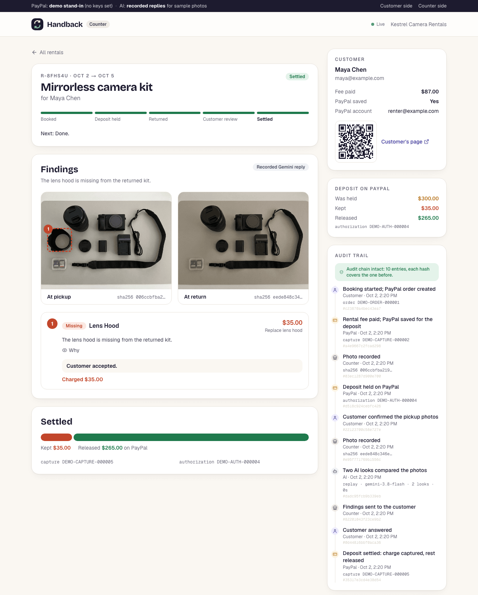
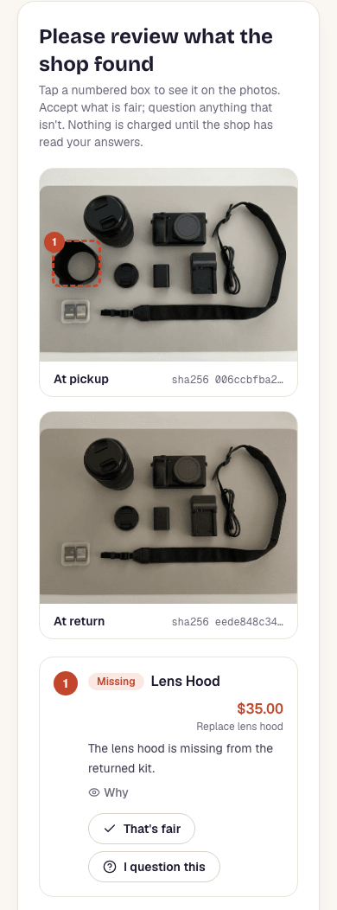
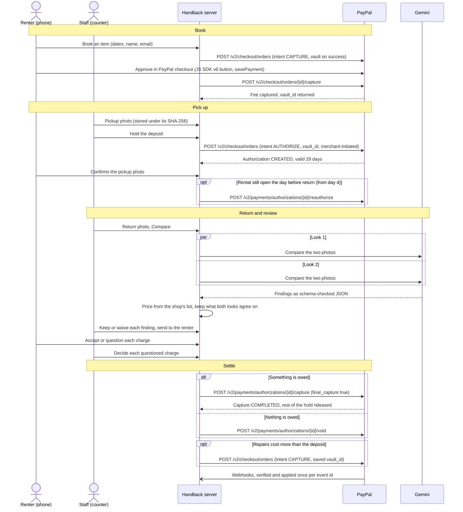

# Handback

[](https://github.com/OWNER/REPO/actions/workflows/ci.yml)
[](LICENSE)
[](https://codespaces.new/OWNER/REPO)

Handback lets a small rental shop hold a deposit with PayPal and settle it from photos: AI compares the pickup and return photos, the renter accepts or questions each proposed charge on their own phone, and PayPal captures only the charges that survive that review and releases the rest of the hold.

<table>
  <tr>
    <td width="68%"></td>
    <td width="32%"></td>
  </tr>
  <tr>
    <td>The counter after settling: $35.00 kept for the missing lens hood, $265.00 released.</td>
    <td>The renter's phone: accept or question each charge.</td>
  </tr>
</table>

<sub>Screenshots from the end-to-end test in demo mode. The item photos are AI-generated.</sub>

## Why

A deposit deduction is hard to accept when you cannot see how it was decided. Handback shows the renter the pickup and return photos, the price from the shop's own list, and each proposed charge before anything is taken from the deposit. Until then the deposit is only a PayPal hold, and when the shop settles, PayPal releases whatever was not kept.

## What it does

1. **Book.** The renter pays the rental fee with the PayPal button. In the same approval, PayPal saves their account for later charges by this shop. No deposit is taken yet.
2. **Pick up.** Staff photograph the item and tap once: PayPal holds the deposit on the saved account, with the renter not present. A hold reserves the money without taking it, and its 29-day validity starts when the item leaves the shop. The renter is asked to confirm the pickup photo on their phone.
3. **Return.** Staff photograph the item again. Two independent Gemini calls compare the photos, and code prices what they both found from the shop's repair list. Staff keep or waive each finding, the renter accepts or questions each one on their phone, and staff decide the questioned ones. Then one PayPal capture takes what is owed after that review, up to the deposit, and PayPal releases the rest of the hold. If nothing is owed, the hold is voided.

## Run it in two minutes

### Demo mode: no accounts, no keys

You need Node.js 22.12 or later and npm.

```bash
git clone https://github.com/OWNER/REPO.git
cd REPO
npm ci
npm run dev
```

Or open the repository in GitHub Codespaces with the badge above: the dev container installs everything and starts the app in demo mode on port 3000.

With no keys set, PayPal is replaced by a local stand-in that enforces the rules we measured in the sandbox, and the photo comparison replays recorded Gemini replies for the bundled sample photos. The strip at the top of every page says which parts are real.

Open http://localhost:3000 and use two tabs, one as the renter and one as the counter:

1. Renter: **Rent something**, pick the mirrorless camera kit, enter a name and email, and press **Pay $87.00 (demo PayPal)**.
2. Counter: open http://localhost:3000/shop, pick the rental, choose the **Pickup photo** sample, then **Hold $300.00 deposit**.
3. Renter: **Yes, this is how I received it**.
4. Counter: choose the **Hood removed** return sample, then **Compare the photos**, then **Send 1 item to** the renter.
5. Renter: **That's fair** (or **I question this** with a reason), then **Send my answers**.
6. Counter: **Keep $35.00, release $265.00**. Both pages update without a reload.

In a Codespace, the counter's QR code and "Customer's page" link point at `http://localhost:3000` unless you set `APP_URL` to the forwarded address; the renter tab you booked in works either way.

### Sandbox mode: real PayPal sandbox calls

1. In the [PayPal developer dashboard](https://developer.paypal.com/dashboard/), create a sandbox REST app bound to a US sandbox business account, with **Vault** enabled.
2. `cp .env.example .env.local`, then set `PAYPAL_CLIENT_ID` and `PAYPAL_CLIENT_SECRET`. Add `GEMINI_API_KEY` to compare your own photos with live Gemini; without it, only the sample photos can be compared.
3. `npm run dev`. The strip now reads **PayPal: sandbox**. Book as above and approve in PayPal's checkout with a sandbox personal account.

[CONTRIBUTING.md](CONTRIBUTING.md) lists every environment variable the code reads, and covers webhooks, the hold renewal job and the sandbox scripts.

## How we use PayPal

Terms used below:

- **Vault**: PayPal saves the renter's account for this merchant and returns a payment token (`vault_id`) that later charges can use while the renter is not present.
- **Hold**: a PayPal authorization. The money is reserved, not taken. A hold is valid for 29 days; after the first 3 (the honor period), PayPal recommends reauthorizing to make sure the funds are still available.
- **Capture**: taking money from a hold. With `final_capture: true`, PayPal releases whatever is left.
- **Void**: releasing a hold without taking anything.
- **Reauthorize**: renewing a hold, from day 4 to day 29. Handback does it at most once per rental.

| Capability | API or SDK call | Code |
|---|---|---|
| PayPal button on the booking page, saving the renter's account | JS SDK v6 through `@paypal/react-paypal-js/sdk-v6`: `PayPalProvider` and `PayPalOneTimePaymentButton` with `savePayment` | [`components/booking-form.tsx`](components/booking-form.tsx) |
| Amounts set on the server | The button's `createOrder` calls a server action; the fee is the catalog's daily rate times the days, never a number from the browser | [`app/actions.ts`](app/actions.ts), [`lib/rentals/service.ts`](lib/rentals/service.ts) (`startBooking`) |
| Booking order: the rental fee, with the account saved on success | Orders v2 `POST /v2/checkout/orders`, `intent: CAPTURE`, `payment_source.paypal.attributes.vault` with `store_in_vault: ON_SUCCESS`, `usage_type: MERCHANT` (Server SDK `OrdersController.createOrder`) | [`lib/paypal/paypal-gateway.ts`](lib/paypal/paypal-gateway.ts) (`createBookingOrder`) |
| Capture the fee after approval and keep the `vault_id` | Orders v2 `POST /v2/checkout/orders/{id}/capture` (`OrdersController.captureOrder`) | [`lib/paypal/paypal-gateway.ts`](lib/paypal/paypal-gateway.ts) (`captureBookingOrder`) |
| Hold the deposit at pickup, renter not present | Orders v2 `POST /v2/checkout/orders`, `intent: AUTHORIZE`, `payment_source.paypal.vault_id` with `stored_credential` (`MERCHANT`, `SUBSEQUENT`, `UNSCHEDULED_POSTPAID`) | [`lib/paypal/paypal-gateway.ts`](lib/paypal/paypal-gateway.ts) (`holdWithSavedWallet`) |
| Settle: one capture of what is owed after review, the rest released | Payments v2 `POST /v2/payments/authorizations/{id}/capture` with `final_capture: true` (`PaymentsController.captureAuthorizedPayment`) | [`lib/paypal/paypal-gateway.ts`](lib/paypal/paypal-gateway.ts) (`settle`), [`lib/rentals/service.ts`](lib/rentals/service.ts) (`settle`) |
| Release the whole deposit when nothing is owed | Payments v2 `POST /v2/payments/authorizations/{id}/void` (`PaymentsController.voidPayment`) | [`lib/paypal/paypal-gateway.ts`](lib/paypal/paypal-gateway.ts) (`release`) |
| Charge repairs that cost more than the deposit | Orders v2 `POST /v2/checkout/orders`, `intent: CAPTURE` on the saved `vault_id` | [`lib/paypal/paypal-gateway.ts`](lib/paypal/paypal-gateway.ts) (`chargeSavedWallet`) |
| Renew a hold the day before the item is due back, never before day 4, at most once | Payments v2 `POST /v2/payments/authorizations/{id}/reauthorize` (`PaymentsController.reauthorizePayment`), run by `POST /api/jobs/renew-holds` | [`lib/rentals/jobs.ts`](lib/rentals/jobs.ts), [`app/api/jobs/renew-holds/route.ts`](app/api/jobs/renew-holds/route.ts) |
| Refund part of a capture, and read a hold | Payments v2 `POST /v2/payments/captures/{id}/refund` and `GET /v2/payments/authorizations/{id}`. Only the sandbox smoke script calls these; the app has no refund button yet | [`lib/paypal/paypal-gateway.ts`](lib/paypal/paypal-gateway.ts) (`refund`, `getAuthorization`), [`scripts/sandbox-smoke.ts`](scripts/sandbox-smoke.ts) |
| No double charges | A `PayPal-Request-Id` on every order and payment POST, derived from the rental (`booking:<id>`, `booking-capture:<id>`, `deposit:<id>`, `settle:<id>`, `release:<id>`, `extra:<id>`, `reauth:<id>:<date>`), so a retry returns the first result | [`lib/rentals/service.ts`](lib/rentals/service.ts), [`lib/rentals/jobs.ts`](lib/rentals/jobs.ts) |
| Retries and tokens | One long-lived Server SDK client, which caches and refreshes its OAuth token, retrying GET, POST and PATCH on 408, 429, 500, 502, 503 and 504. A small REST client covers the webhook APIs: it caches its token, refreshes it on a 401, and honours `Retry-After` | [`lib/paypal/sdk.ts`](lib/paypal/sdk.ts), [`lib/paypal/rest.ts`](lib/paypal/rest.ts) |
| Errors people can act on | A PayPal error keeps PayPal's `issue` and `debug_id` and is written to the rental's audit trail. On the booking page and at the counter it becomes a message with the PayPal reference, and known issues are explained in plain words (for example `INSTRUMENT_DECLINED`, `MAX_CAPTURE_AMOUNT_EXCEEDED`, `AUTHORIZATION_EXPIRED`) | [`lib/paypal/errors.ts`](lib/paypal/errors.ts), [`lib/rentals/service.ts`](lib/rentals/service.ts) (`paypalStep`) |
| Webhook verification | Offline RSA-SHA256 check of the signature over transmission id, time, webhook id and the body's CRC-32, against a currently valid certificate from a paypal.com host; `POST /v1/notifications/verify-webhook-signature` as the fallback; anything unverified gets a 401 | [`lib/paypal/webhook-signature.ts`](lib/paypal/webhook-signature.ts), [`lib/paypal/webhooks.ts`](lib/paypal/webhooks.ts), [`app/api/paypal/webhooks/route.ts`](app/api/paypal/webhooks/route.ts) |
| Webhook handling | Each event is applied once (deduplicated on its id) and logged on the rental it belongs to; `CUSTOMER.DISPUTE.CREATED` marks the rental disputed | [`lib/rentals/webhooks.ts`](lib/rentals/webhooks.ts) |
| Webhook registration | `GET` and `POST /v1/notifications/webhooks` | [`scripts/register-webhook.ts`](scripts/register-webhook.ts) |
| Demo mode | A stand-in that enforces the sandbox rules: no capture above the hold, no void after a final capture, one reauthorization from day 4, the first result for a repeated request id | [`lib/paypal/demo-gateway.ts`](lib/paypal/demo-gateway.ts) |

The gateway also has `createHold` and `authorizeHold`, an AUTHORIZE order the renter approves, meant for renters who did not save PayPal at booking. No page calls them yet: the counter can only hold a deposit on a saved account.

Before building on PayPal, we checked each behaviour in the sandbox: partial capture, void, over-capture, reauthorization timing, refund, and saving PayPal at booking to hold the deposit later. [docs/paypal-sandbox-notes.md](docs/paypal-sandbox-notes.md) records what we tried and what PayPal returned.

## How we use AI

| What | How | Code |
|---|---|---|
| Two independent looks | Two `gemini-3.8-flash` calls (thinking level low, high media resolution) compare the same pickup and return photos in parallel | [`lib/inspection/run.ts`](lib/inspection/run.ts), [`lib/inspection/compare.ts`](lib/inspection/compare.ts) |
| Schema-validated output, one repair turn | The model must answer in JSON that matches a zod schema (passed to Gemini as `responseJsonSchema`). An invalid reply gets one repair turn with the validation error; a second failure is an error, not a guess | [`lib/inspection/schema.ts`](lib/inspection/schema.ts), [`lib/inspection/compare.ts`](lib/inspection/compare.ts) |
| The model never names an amount | It returns a finding kind (missing, new damage, dirt, pre-existing, wear), boxes on both photos, a confidence, and the id of an entry in the shop's price list | [`lib/inspection/prompt.ts`](lib/inspection/prompt.ts), [`lib/catalog.ts`](lib/catalog.ts) |
| Deterministic pricing gate | Only missing, new-damage and dirt findings with a matching price-list entry of the right kind can be charged. Low-confidence findings, pre-existing marks and wear become notes, never charges; a damage or cleaning repair reported twice is charged once; medium confidence is flagged for a person to check | [`lib/inspection/policy.ts`](lib/inspection/policy.ts) |
| Consensus rule | A charge is proposed only when both looks report the same kind of finding with the same price-list entry, at the lower of the two confidences. A charge only one look saw becomes a note | [`lib/inspection/consensus.ts`](lib/inspection/consensus.ts) |
| Photo checks before any model call | Blurry, dark or washed-out photos are rejected at the counter (Laplacian variance and brightness) | [`lib/photos.ts`](lib/photos.ts) |
| People make the decision | Staff keep or waive, the renter accepts or questions with a reason, staff rule on questioned items, and the settlement amount is plain arithmetic over what is left | [`lib/rentals/service.ts`](lib/rentals/service.ts), [`lib/rentals/settlement.ts`](lib/rentals/settlement.ts) |

How well it works, from [eval/README.md](eval/README.md): 36 labeled photo pairs of the eight demo items, three runs per setup. 12 pairs contain 14 real changes (a removed accessory, new damage or dirt); 24 pairs differ only in light, framing, dust or glare.

| Setup | Real changes proposed as a charge | With the right price-list entry | Unchanged pairs charged | Worst p95 latency |
|---|---|---|---|---|
| 1 look | 40/42 (95%) | 40/40 | 1/72 (1%) | 12.7 s |
| 2 looks that must agree (what the app runs) | 41/42 (98%) | 41/41 | 0/72 (0%) | 17.5 s |

What this means: with two looks, a real change was proposed as a charge, at the right price, in 41 of 42 cases, and an unchanged item was never charged in 72 tries. The one miss was a bent mudguard under mud on the e-bike in one run; the mud on the same pair was caught. A single look charged one unchanged pair; requiring two looks to agree removed that false charge in these runs. All photos in this set are AI-generated, which makes the ground truth exact but is easier than real counter photos.

## The flow, call by call



## Fairness and safety

- **The model only proposes.** It points at a price-list entry and never names an amount. Code turns findings into charges, and low-confidence findings, marks that were already there and normal wear are never charged.
- **Two looks must agree** before anything is proposed, so a mark that only one call imagined never reaches the renter's bill.
- **Bad photos stop at the counter.** Blurry or badly exposed photos are rejected before any model sees them, and photos the model cannot use, or that do not show the same item, produce no charges.
- **People decide.** Staff keep or waive each finding, the renter accepts or questions it with a reason, and a questioned charge needs an explicit decision by staff. Settlement refuses to run while any answer or decision is missing.
- **Amounts come from the server.** The fee is computed from the catalog, a settlement can never exceed the hold (checked before PayPal is called), and request ids derived from the rental mean a double tap or a retry cannot charge twice.
- **Evidence the renter can check.** Photos are stored under the SHA-256 of their bytes, the renter sees that hash when confirming the pickup photo, and every step is written to a hash-chained audit log with its PayPal ids.
- **Honest labels.** The strip on every page says whether PayPal and the AI are real or stand-ins, and sample photos are labeled as AI-generated.

Known limits of this build:

- The counter pages have no sign-in. Anyone who can reach a running copy can act as staff.
- The renter's page is protected only by the random token in its link.
- The audit log is tamper-evident, not tamper-proof: anyone with write access to the database can rewrite the whole chain.
- Live page updates use an in-process event bus, so the app is meant to run as a single server instance.
- A renter who did not save PayPal at booking cannot have a deposit held yet (see the note under the PayPal table).

## Testing

- **Unit tests** (`npm test`, vitest): cents and PayPal amounts (`lib/money.test.ts`); the pricing gate and the consensus rule (`lib/inspection/policy.test.ts`); the PayPal stand-in's sandbox rules (`lib/paypal/demo-gateway.test.ts`); webhook signature checks (`lib/paypal/webhook-signature.test.ts`); whole rentals in demo mode, covering the damage, clean and contested paths, audit-chain tampering, and webhook deduplication and disputes (`lib/rentals/service.test.ts`); and hold renewal timing (`lib/rentals/jobs.test.ts`).
- **End-to-end test** (`npm run e2e`, Playwright): builds the app, starts it in demo mode, and drives one rental from booking to settlement with the counter on a desktop and the renter on a phone-sized screen. The renter's page must update without a reload at each step, and the test ends on $35.00 kept, $265.00 released and an intact audit chain ([`e2e/rental-flow.spec.ts`](e2e/rental-flow.spec.ts)).
- **CI** runs route type generation, lint, typecheck and the unit tests, and the end-to-end test in a second job, on every push and pull request ([`.github/workflows/ci.yml`](.github/workflows/ci.yml)). Both run in demo mode with no secrets.
- **PayPal sandbox.** `npm run smoke:sandbox` runs the real gateway against the sandbox: partial capture, a repeated request id returning the first capture, refund, void, and the reauthorization error. `scripts/sandbox-walkthrough.ts` drives the running app in a browser with the JS SDK v6 button and a sandbox buyer approving in PayPal's popup. One full run, from [docs/paypal-sandbox-notes.md](docs/paypal-sandbox-notes.md), took about 33 seconds:

  | Step | PayPal sandbox result |
  |---|---|
  | Booking with the v6 button; the buyer approves | order `0HL96236BY116954N`, fee capture `88W11018NV496100U`, account saved |
  | Pickup: deposit held on the saved account, buyer not present | authorization `00T82573RL225500P`, $300.00, expires in 29 days |
  | Return: two live `gemini-3.8-flash` looks in 5.6 s, both report the missing lens hood | proposal: $35.00 from the price list |
  | The renter accepts; the counter settles | capture `27E47755F4775162P`: $35.00 kept, $265.00 released |

- **AI eval** (`npm run eval`): scores the photo comparison on the labeled pairs; results and raw model replies are in [`eval/`](eval/).

## Project structure

```
app/                       Next.js App Router
  page.tsx                 landing page
  rent/                    storefront and booking (renter)
  r/[token]/               the renter's own rental page
  shop/                    the counter: today's rentals and the rental workflow
  actions.ts               server actions
  api/paypal/webhooks/     PayPal webhook receiver
  api/jobs/renew-holds/    hold renewal job, protected by CRON_SECRET
  api/live/[channel]/      server-sent events that keep pages live
  api/photos/[sha]/        photos by SHA-256
  api/samples/[...key]/    bundled sample photos
components/                UI: booking form with the PayPal button, findings view, money bar, audit timeline
lib/
  paypal/                  gateway interface, Server SDK gateway, demo stand-in, REST client, webhook verification
  inspection/              prompt, output schema, Gemini call, pricing policy, consensus rule
  rentals/                 rental service, settlement arithmetic, audit chain, hold renewal, webhook handling
  db/                      PGlite or Postgres client and the schema
  catalog.ts               the demo shop's eight items, kits, deposits and repair prices
  money.ts                 integer cents and PayPal amount strings
  photos.ts                photo storage and quality checks
e2e/                       Playwright test
eval/                      labeled photo pairs, recorded model replies, results
scripts/                   sandbox smoke test and walkthrough, webhook registration, eval, git hooks
docs/                      PayPal sandbox notes, AI build log, README screenshots
```

Built with Next.js 16, React 19, TypeScript, Tailwind CSS 4, zod, the PayPal Server SDK, the PayPal JS SDK v6, the Google Gen AI SDK, PGlite or Postgres, Vitest and Playwright.

## In progress

- A desk for answering PayPal disputes
- Deployment on Render
- An eval set of real counter photos
- An MCP endpoint for booking

## More documentation

- [CONTRIBUTING.md](CONTRIBUTING.md): setup, environment variables, sandbox scripts, tests and the commit convention
- [SECURITY.md](SECURITY.md): how to report a vulnerability, and the known limits
- [CODE_OF_CONDUCT.md](CODE_OF_CONDUCT.md)
- [docs/paypal-sandbox-notes.md](docs/paypal-sandbox-notes.md): PayPal behaviour verified in the sandbox
- [eval/README.md](eval/README.md): how the photo comparison is scored
- [docs/ai-build-log.md](docs/ai-build-log.md): how AI coding tools were used to build this, and what they got wrong

## License

[MIT](LICENSE). Kestrel Camera Rentals is a fictional demo shop.
