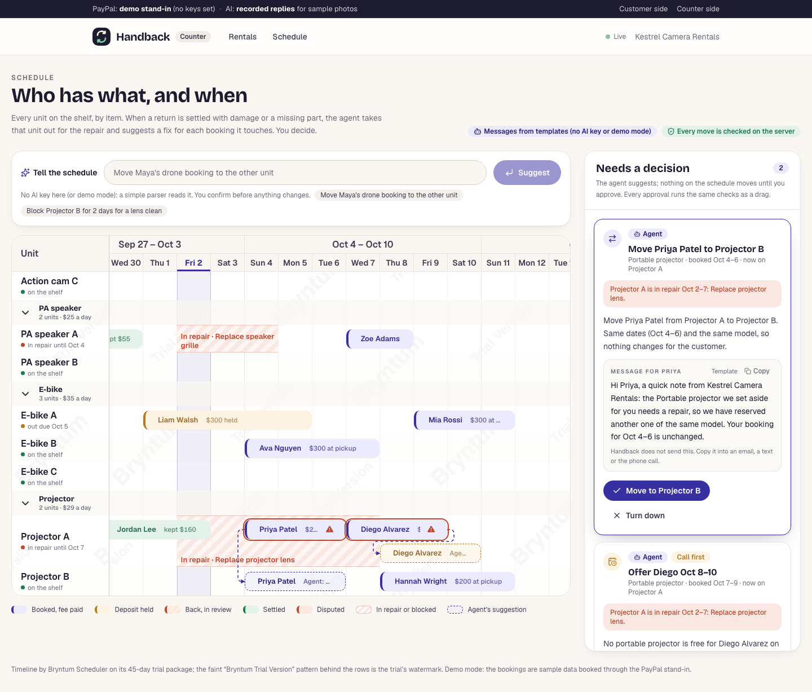

# Handback

[](https://github.com/ZNLong2203/handback/actions/workflows/ci.yml)
[](LICENSE)
[](https://codespaces.new/ZNLong2203/handback)

Handback lets a small rental shop hold a deposit with PayPal and settle it from photos: AI compares the pickup and return photos, the renter accepts or questions each proposed charge on their own phone, and PayPal captures only the charges that survive that review and releases the rest of the hold. If the renter later disputes a charge in PayPal, the shop answers from the same record.

<table>
  <tr>
    <td width="68%"></td>
    <td width="32%"></td>
  </tr>
  <tr>
    <td>The counter after settling: $35.00 kept for the missing lens hood, $265.00 released.</td>
    <td>The renter's phone: accept or question each charge.</td>
  </tr>
</table>

<sub>Screenshots from the end-to-end test in demo mode. The item photos are AI-generated.</sub>

## Why

A deposit deduction is hard to accept when you cannot see how it was decided. Handback shows the renter the pickup and return photos, the price from the shop's own list, and each proposed charge before anything is taken from the deposit. Until then the deposit is only a PayPal hold, and when the shop settles, PayPal releases whatever was not kept.

In October 2026 we interviewed the owner of one bicycle rental shop in Vietnam; the numbers are the owner's own estimates. The shop has 50 to 70 bikes and 400 to 600 rentals a month, and takes deposits of 200,000 to 500,000 VND per bike in cash or by bank transfer, not with PayPal. Staff check each bike by eye in 3 to 5 minutes, and returning a deposit takes 5 to 10 minutes when the shop is quiet and 15 to 30 minutes when it is busy. Problems turn up in 5 to 10 percent of returns (scratches, lost lights, locks, phone holders), and there are 5 to 10 deposit arguments a month, 2 to 3 of them long. Only 30 to 40 percent of pickups are photographed, and the shop absorbs 2 to 5 million VND (about $75 to $190) a month in repairs it cannot prove. The owner said an AI check would earn their trust if it showed where the damage is, with marked before and after photos, the time, the bike's ID and the handover history, and if the customer saw the evidence directly. It is one shop: it shows the problem is real for someone, not how common it is.

## What it does

1. **Book.** The renter pays the rental fee with the PayPal button. In the same approval, PayPal saves their account for later charges by this shop. The booking also records a deposit mandate: the most the shop may hold, the repair price list, and when it ends. No deposit is taken yet.
2. **Pick up.** Staff photograph the item and tap once: PayPal holds the deposit on the saved account, with the renter not present. A hold reserves the money without taking it, and its 29-day validity starts when the item leaves the shop. The renter is asked to confirm the pickup photo on their phone.
3. **Return.** Staff photograph the item again. Two independent Gemini calls compare the photos, and code prices what they both found from the price list in the mandate. Staff keep or waive each finding, the renter accepts or questions each one on their phone, and staff decide the questioned ones. Then one PayPal capture takes what is owed after that review, up to the deposit, and PayPal releases the rest of the hold. If nothing is owed, the hold is voided.

Also in this build:

- **Answer a PayPal dispute from the rental's record.** A dispute arrives by webhook (or from the counter's "Check PayPal for disputes" button) and opens a desk on the rental. Code builds a one-page evidence PDF from what was recorded: both photos with their SHA-256, what the renter accepted on their phone, the PayPal ids and the audit chain. The desk recommends fighting, offering part back or accepting, from the record and PayPal's published dispute fee, and sends the pack and both photos to PayPal.
- **A schedule of physical units, with a repair agent.** Each booking gets a physical unit (for example "Projector B") when it is made. `/shop/schedule` shows every unit on a Bryntum Scheduler timeline. When a settled return has a charged damage or missing part, the unit is blocked for its repair, and an agent suggests a fix for each booking that now clashes: another unit, later dates, or a call. Staff approve each suggestion; drags and typed commands go through the same checks on the server.
- **Cancelling before pickup.** The booking page states the cancellation policy next to the price list: the whole fee back when cancelled at least 24 hours before the pickup day starts, half after that, nothing from the pickup day on (whole days in UTC). Each new booking's deposit mandate fixes those terms to its dates. The renter cancels on their own page and PayPal refunds what the terms give back at that moment; the counter can cancel with any refund from $0.00 up to the fee and a reason the renter sees. An unpaid booking is cancelled without calling PayPal. The unit goes back on the schedule, both pages update live, and an assistant can read the cancellation over MCP but cannot cancel.
- **Refunds after settling.** If the shop kept too much, staff refund part or all of the settlement capture (or of the charge above the deposit) from the counter, with a reason the renter sees on their page. The same form refunds the rest of a cancelled booking's fee. A double submit refunds once, and while a PayPal dispute is open the counter sends staff to the dispute desk instead.
- **Booking through an AI assistant over MCP.** `/api/mcp` lets an assistant (Claude Desktop, Claude Code or any MCP client) list items, quote, start a booking and follow it with a read-only status token. The assistant hands the person PayPal's approval link. Money moves only after the person approves in PayPal and the counter settles, and every hold and charge is checked against the deposit mandate first.



<sub>The schedule in demo mode after a return with a cracked projector lens. The faint pattern behind the rows is the Bryntum trial watermark.</sub>

## Run it in two minutes

### Demo mode: no accounts, no keys

You need Node.js 22.12 or later and npm.

```bash
git clone https://github.com/ZNLong2203/handback.git
cd handback
npm ci
npm run dev
```

Or open the repository in GitHub Codespaces with the badge above: the dev container installs everything and starts the app in demo mode on port 3000.

With no keys set, PayPal (including its Disputes API) is replaced by a local stand-in that enforces the rules we measured in the sandbox, and the photo comparison replays recorded Gemini replies for the bundled sample photos. The strip at the top of every page says which parts are real.

Open http://localhost:3000 and use two tabs, one as the renter and one as the counter:

1. Renter: **Rent something**, pick the mirrorless camera kit, enter a name and email, and press **Pay $87.00 (demo PayPal)**.
2. Counter: open http://localhost:3000/shop, pick the rental, choose the **Pickup photo** sample, then **Hold $300.00 deposit**.
3. Renter: **Yes, this is how I received it**.
4. Counter: choose the **Hood removed** return sample, then **Compare the photos**, then **Send 1 item to** the renter.
5. Renter: **That's fair** (or **I question this** with a reason), then **Send my answers**.
6. Counter: **Keep $35.00, release $265.00**. Both pages update without a reload.

Then, still in demo mode:

- **Refund.** On the settled rental, under **Refunds**, enter an amount and the reason the renter will see, then **Refund** and confirm. The renter's page shows it without a reload.
- **Cancel.** Book another item with a pickup date two or more days ahead. On the renter's page, **Cancel this booking** shows what comes back (the whole fee this early) and asks to confirm; the counter's page turns to **Cancelled** with the refund without a reload. On a booked rental at the counter, **Cancel the booking** lets staff choose the refund and type the reason the renter sees.
- **Dispute.** On the settled rental, press **Demo stand-in: the customer disputes this charge with PayPal**, then **Prepare the evidence pack**, **Send to PayPal** and confirm. The panel's **Demo stand-in: play PayPal's part** buttons ask for evidence again and decide the case.
- **Schedule.** Open **Schedule** at the counter. The first visit books two weeks of sample rentals through the real service; [docs/bryntum.md](docs/bryntum.md#demo-data) shows how to stage a damaged return.
- **Assistant.** `claude mcp add --transport http handback http://localhost:3000/api/mcp`, or any client from [docs/agents.md](docs/agents.md#connecting-a-client). In demo mode the approval link opens a page labelled as a stand-in for PayPal.

In a Codespace, the counter's QR code and "Customer's page" link point at `http://localhost:3000` unless you set `APP_URL` to the forwarded address; the renter tab you booked in works either way.

### Sandbox mode: real PayPal sandbox calls

1. In the [PayPal developer dashboard](https://developer.paypal.com/dashboard/), create a sandbox REST app bound to a US sandbox business account, with **Vault** enabled.
2. `cp .env.example .env.local`, then set `PAYPAL_CLIENT_ID` and `PAYPAL_CLIENT_SECRET`. Add `GEMINI_API_KEY` to compare your own photos with live Gemini; without it, only the sample photos can be compared.
3. `npm run dev`. The strip now reads **PayPal: sandbox**. Book as above and approve in PayPal's checkout with a sandbox personal account.

[CONTRIBUTING.md](CONTRIBUTING.md) lists every environment variable the code reads, and covers webhooks, the hold renewal job and the sandbox scripts.

### On Render

[`render.yaml`](render.yaml) is a Render Blueprint: the web service, Render Postgres, a Render Workflows service that runs photo comparisons and hold renewals as tasks with retries, and an hourly cron job. [docs/deploy.md](docs/deploy.md) has the steps and costs. The Blueprint passes Render's published schema and the tasks ran on a development machine through the Render CLI's local task server; it has not been deployed on Render yet.

`DEMO_RESET=true`, meant only for the public demo judges use, makes the copy start over once a day (20:00 UTC by default, `DEMO_RESET_HOUR`): the cron job has the web service delete every rental and seed the sample ones again, and the counter and booking page say when ([docs/deploy.md](docs/deploy.md#daily-demo-reset)).

## How we use PayPal

Terms used below:

- **Vault**: PayPal saves the renter's account for this merchant and returns a payment token (`vault_id`) that later charges can use while the renter is not present.
- **Hold**: a PayPal authorization. The money is reserved, not taken. A hold is valid for 29 days; after the first 3 (the honor period), PayPal recommends reauthorizing to make sure the funds are still available.
- **Capture**: taking money from a hold. With `final_capture: true`, PayPal releases whatever is left.
- **Void**: releasing a hold without taking anything.
- **Reauthorize**: renewing a hold, from day 4 to day 29. Handback does it at most once per rental.
- **Dispute**: a case the renter opens in PayPal against a payment. Each read of it carries links for the actions the shop may take next.

| Capability | API or SDK call | Code |
|---|---|---|
| PayPal button on the booking page, saving the renter's account | JS SDK v6 through `@paypal/react-paypal-js/sdk-v6`: `PayPalProvider` and `PayPalOneTimePaymentButton` with `savePayment` | [`components/booking-form.tsx`](components/booking-form.tsx) |
| Amounts set on the server | The button's `createOrder` calls a server action; the fee is the catalog's daily rate times the days, never a number from the browser | [`app/actions.ts`](app/actions.ts), [`lib/rentals/service.ts`](lib/rentals/service.ts) (`startBooking`) |
| Booking order: the rental fee, with the account saved on success | Orders v2 `POST /v2/checkout/orders`, `intent: CAPTURE`, `payment_source.paypal.attributes.vault` with `store_in_vault: ON_SUCCESS`, `usage_type: MERCHANT`, and `experience_context` with `return_url` and `cancel_url` (Server SDK `OrdersController.createOrder`) | [`lib/paypal/paypal-gateway.ts`](lib/paypal/paypal-gateway.ts) (`createBookingOrder`) |
| Capture the fee after approval and keep the `vault_id` | Orders v2 `POST /v2/checkout/orders/{id}/capture` (`OrdersController.captureOrder`) | [`lib/paypal/paypal-gateway.ts`](lib/paypal/paypal-gateway.ts) (`captureBookingOrder`), [`lib/rentals/service.ts`](lib/rentals/service.ts) (`confirmBooking`) |
| Approval by redirect, for bookings an assistant makes | The assistant hands the person the order's `payer-action` link. `return_url` is the renter's page: when PayPal sends them back with a `token` that matches the rental's order and a `PayerID`, the server captures through the same `confirmBooking` the button uses, then moves to the clean URL, so a reload captures nothing. `cancel_url` is `/paypal/cancelled`, which carries no renter token, because anyone holding the approval link can follow PayPal's cancel link | [`lib/rentals/service.ts`](lib/rentals/service.ts) (`returnFromPayPal`, `paypalCancelUrl`), [`app/r/[token]/page.tsx`](app/r/[token]/page.tsx), [`app/paypal/cancelled/page.tsx`](app/paypal/cancelled/page.tsx) |
| A fee capture PayPal leaves pending | The rental keeps the capture id and stays unpaid; the `PAYMENT.CAPTURE.COMPLETED` webhook for that capture books it, and `PAYMENT.CAPTURE.DENIED` cancels it with nothing charged. Tested with a stubbed gateway; the sandbox has not returned a pending booking capture | [`lib/rentals/service.ts`](lib/rentals/service.ts) (`confirmBooking`), [`lib/rentals/webhooks.ts`](lib/rentals/webhooks.ts) (`applyPayPalWebhook`) |
| Hold the deposit at pickup, renter not present | Orders v2 `POST /v2/checkout/orders`, `intent: AUTHORIZE`, `payment_source.paypal.vault_id` with `stored_credential` (`MERCHANT`, `SUBSEQUENT`, `UNSCHEDULED_POSTPAID`) | [`lib/paypal/paypal-gateway.ts`](lib/paypal/paypal-gateway.ts) (`holdWithSavedWallet`), [`lib/rentals/service.ts`](lib/rentals/service.ts) (`holdDeposit`) |
| The deposit mandate, checked before every hold and charge | No PayPal call: before the hold and before the settlement capture or saved-wallet charge, the server checks the hold against the mandate's limit, each charge against its price list and the renter's answer, and the date against its end. The stored mandate must hash to the value the audit chain recorded at booking, and the chain must verify. A refusal is written to the audit log and PayPal is not called | [`lib/rentals/mandate.ts`](lib/rentals/mandate.ts) (`mandateViolations`), [`lib/rentals/service.ts`](lib/rentals/service.ts) (`holdDeposit`, `settle`) |
| Settle: one capture of what is owed after review, the rest released | Payments v2 `POST /v2/payments/authorizations/{id}/capture` with `final_capture: true` (`PaymentsController.captureAuthorizedPayment`) | [`lib/paypal/paypal-gateway.ts`](lib/paypal/paypal-gateway.ts) (`settle`), [`lib/rentals/service.ts`](lib/rentals/service.ts) (`settle`) |
| Release the whole deposit when nothing is owed | Payments v2 `POST /v2/payments/authorizations/{id}/void` (`PaymentsController.voidPayment`) | [`lib/paypal/paypal-gateway.ts`](lib/paypal/paypal-gateway.ts) (`release`) |
| Refund part or all of a settled charge | Payments v2 `POST /v2/payments/captures/{id}/refund` with `amount`, `note_to_payer` (the reason staff typed) and `invoice_id` (`PaymentsController.refundCapturedPayment`). Only the settlement capture, the charge above the deposit and the fee of a cancelled booking, never more than is left on that capture after earlier refunds and money a dispute gave back, and not while a PayPal dispute on the rental is open. A refund whose answer was lost can be sent again unchanged for an hour. Run in the sandbox from the counter | [`lib/paypal/paypal-gateway.ts`](lib/paypal/paypal-gateway.ts) (`refund`), [`lib/rentals/refunds.ts`](lib/rentals/refunds.ts) (`refundCharge`), [`components/refund-form.tsx`](components/refund-form.tsx) |
| Cancel a booking before pickup, refunding the fee by the policy | The same Payments v2 refund, on the fee capture from the booking order, through the counter's refund code (`claimRefund`, `sendRefund`): the renter gets the share the mandate's cancellation terms give at that moment, the counter any amount up to the fee. An unpaid booking is cancelled with no PayPal call. Should a deposit hold exist, it is voided (`POST /v2/payments/authorizations/{id}/void`). Refused once the item is picked up and while a PayPal dispute is open. Run in the sandbox through the service functions: half the fee refunded under the policy, then the rest with the counter's `refundCharge` | [`lib/rentals/cancel.ts`](lib/rentals/cancel.ts) (`cancelAsRenter`, `cancelAtCounter`), [`lib/rentals/cancellation.ts`](lib/rentals/cancellation.ts), [`lib/shop.ts`](lib/shop.ts) (`CANCELLATION_POLICY`), [`components/cancel-form.tsx`](components/cancel-form.tsx) |
| Charge repairs that cost more than the deposit | Orders v2 `POST /v2/checkout/orders`, `intent: CAPTURE` on the saved `vault_id` | [`lib/paypal/paypal-gateway.ts`](lib/paypal/paypal-gateway.ts) (`chargeSavedWallet`) |
| Renew a hold the day before the item is due back, never before day 4, at most once | Payments v2 `POST /v2/payments/authorizations/{id}/reauthorize` (`PaymentsController.reauthorizePayment`), run by `POST /api/jobs/renew-holds` | [`lib/rentals/jobs.ts`](lib/rentals/jobs.ts) (`renewDueHolds`), [`app/api/jobs/renew-holds/route.ts`](app/api/jobs/renew-holds/route.ts) |
| Hold renewals on Render Workflows, where configured | The hourly cron job calls `POST /api/jobs/renew-holds`, which starts a `renew-holds` task run keyed by the hour; the task runs the same `renewDueHolds`. Without `RENDER_WORKFLOW_SLUG` and `RENDER_API_KEY`, in demo mode, or when Render cannot be reached, the sweep runs in the web process | [`lib/workflows/dispatch.ts`](lib/workflows/dispatch.ts) (`runRenewals`), [`workflows/tasks.ts`](workflows/tasks.ts), [`render.yaml`](render.yaml) |
| Find and read disputes | Disputes v1 over REST (the Server SDK has no Disputes controller): `GET /v1/customer/disputes?disputed_transaction_id=…` for each of the rental's captures, and `GET /v1/customer/disputes/{id}` | [`lib/paypal/disputes.ts`](lib/paypal/disputes.ts) (`list`, `get`), [`lib/disputes/service.ts`](lib/disputes/service.ts) (`findDisputes`, `refreshDispute`) |
| Send the evidence pack | `POST /v1/customer/disputes/{id}/provide-evidence` as `multipart/form-data`, built by hand: an `input` JSON part, then the one-page PDF and both original photos. Filed under the evidence type PayPal asked for when the pack is that, otherwise `OTHER` | [`lib/paypal/disputes.ts`](lib/paypal/disputes.ts) (`provideEvidence`), [`lib/paypal/multipart.ts`](lib/paypal/multipart.ts), [`lib/disputes/service.ts`](lib/disputes/service.ts) (`submitEvidence`) |
| Accept the claim, or offer part back | `POST /v1/customer/disputes/{id}/accept-claim` (`REFUND`) and `POST /v1/customer/disputes/{id}/make-offer` (`REFUND`, less than the disputed amount). Not yet run in the sandbox; tested against the stand-in | [`lib/paypal/disputes.ts`](lib/paypal/disputes.ts) (`acceptClaim`, `makeOffer`), [`lib/disputes/service.ts`](lib/disputes/service.ts) |
| Play PayPal's part in the sandbox | `POST /v1/customer/disputes/{id}/require-evidence` and `POST /v1/customer/disputes/{id}/adjudicate`, refused in code outside the sandbox | [`lib/paypal/disputes.ts`](lib/paypal/disputes.ts) (`requireEvidence`, `adjudicate`), [`lib/disputes/service.ts`](lib/disputes/service.ts) (`sandboxRequireEvidence`, `sandboxDecide`) |
| Act only on links PayPal returned | Every dispute action reads the dispute first and follows the link PayPal returned for that action, only to PayPal's own API host. With no link, nothing is sent | [`lib/paypal/disputes.ts`](lib/paypal/disputes.ts), [`lib/paypal/dispute-model.ts`](lib/paypal/dispute-model.ts) (`availableActions`) |
| No double charges | A `PayPal-Request-Id` on every order and payment POST, derived from the rental (`booking:<id>`, `booking-capture:<id>`, `deposit:<id>`, `settle:<id>`, `release:<id>`, `extra:<id>`, `reauth:<id>:<date>`), so a retry returns the first result. A refund uses `refund:<id>:<n>`, where `n` is the rental's next refund number: it is claimed in a `refunds` row before PayPal is called and carried by the counter's form, so sending the same form twice refunds once and a later refund gets a new id. A cancellation's refund takes the next number the same way, and a second press finds the booking cancelled and sends nothing. The deposit hold claims the pickup under the rental's row lock before PayPal is called, so a cancel racing it is refused, or lands first and the hold is refused before PayPal. The Disputes API did not deduplicate on that header in the sandbox, so each dispute action (`dispute-<action>:<dispute id>:<round>`) is first claimed in a `dispute_actions` row, and an error is followed by a read that checks whether the action landed | [`lib/rentals/service.ts`](lib/rentals/service.ts), [`lib/rentals/jobs.ts`](lib/rentals/jobs.ts), [`lib/rentals/refunds.ts`](lib/rentals/refunds.ts), [`lib/disputes/service.ts`](lib/disputes/service.ts), [`lib/paypal/dispute-model.ts`](lib/paypal/dispute-model.ts) (`actionLanded`) |
| Retries and tokens | One long-lived Server SDK client, which caches and refreshes its OAuth token, retrying GET, POST and PATCH on 408, 429, 500, 502, 503 and 504. A small REST client covers the webhook and Disputes APIs: it caches its token, refreshes it on a 401, and retries network failures, stalled bodies, 429 and 5xx with backoff, honouring `Retry-After` and sending the same request id and the same bytes | [`lib/paypal/sdk.ts`](lib/paypal/sdk.ts), [`lib/paypal/rest.ts`](lib/paypal/rest.ts) |
| Errors people can act on | A PayPal error keeps PayPal's `issue` and `debug_id` and is written to the rental's audit trail. On the booking page and at the counter it becomes a message with the PayPal reference, and known issues are explained in plain words (for example `INSTRUMENT_DECLINED`, `MAX_CAPTURE_AMOUNT_EXCEEDED`, `AUTHORIZATION_EXPIRED`) | [`lib/paypal/errors.ts`](lib/paypal/errors.ts), [`lib/rentals/service.ts`](lib/rentals/service.ts) (`paypalStep`) |
| Webhook verification | Offline RSA-SHA256 check of the signature over transmission id, time, webhook id and the body's CRC-32, against a currently valid certificate from a paypal.com host; `POST /v1/notifications/verify-webhook-signature` as the fallback; anything unverified gets a 401 | [`lib/paypal/webhook-signature.ts`](lib/paypal/webhook-signature.ts), [`lib/paypal/webhooks.ts`](lib/paypal/webhooks.ts), [`app/api/paypal/webhooks/route.ts`](app/api/paypal/webhooks/route.ts) |
| Webhook handling | Each event is applied once (deduplicated on its id) and logged on the rental it belongs to. `CUSTOMER.DISPUTE.CREATED`, `UPDATED` and `RESOLVED` store PayPal's view of the case, and a delivery older than the stored one changes nothing. A dispute moves a settled rental to disputed, and back to settled once PayPal has closed every case on it; a dispute opened while the item is still out records the case and leaves the rental out. `PAYMENT.CAPTURE.COMPLETED` and `DENIED` resolve a pending fee capture (above). `CHECKOUT.ORDER.APPROVED` captures a booking whose renter approved but never came back to the page: for a rental still unpaid whose booking order is the event's order, it runs the same `confirmBooking` with the same request id, so the page, the redirect and the webhook capture once between them. If a capture went through unanswered and PayPal later refuses another with `ORDER_ALREADY_CAPTURED`, `confirmBooking` reads the order back (Orders v2 GET) and books from it; a refusal before PayPal (the last unit was booked meanwhile) is written to the audit log. `PAYMENT.CAPTURE.REFUNDED` carries the refund, not the capture: it is matched on the refund id, then on the invoice id of a counter refund whose answer was lost (which it completes), and otherwise on the capture named in its `up` link, which records a refund made outside the app. When applying any event fails, its id is freed and the route answers 500, so PayPal's redelivery is applied rather than called a duplicate | [`lib/rentals/webhooks.ts`](lib/rentals/webhooks.ts) (`applyPayPalWebhook`), [`lib/rentals/refunds.ts`](lib/rentals/refunds.ts) (`recordRefundWebhook`), [`lib/disputes/record.ts`](lib/disputes/record.ts) (`recordDispute`, `rentalStatusFor`) |
| Webhook registration | `GET` and `POST /v1/notifications/webhooks`; `PATCH /v1/notifications/webhooks/{id}` adds missing event types to a URL already registered | [`scripts/register-webhook.ts`](scripts/register-webhook.ts) |
| Demo mode | A stand-in that enforces the sandbox rules: no capture above the hold, no void after a final capture, one reauthorization from day 4, the first result for a repeated request id. A second stand-in plays the Disputes API with the links, requested evidence and fund movements the sandbox returned | [`lib/paypal/demo-gateway.ts`](lib/paypal/demo-gateway.ts), [`lib/paypal/demo-disputes.ts`](lib/paypal/demo-disputes.ts) |

The gateway also has `getAuthorization`, which only the sandbox smoke script calls. When the shop accepts a dispute claim or makes an offer, PayPal refunds the renter through the Disputes API, not through the counter's refund form. The gateway also has `createHold` and `authorizeHold`, an AUTHORIZE order the renter approves, meant for renters who did not save PayPal at booking. No page calls them yet: the counter can only hold a deposit on a saved account.

Before building on PayPal, we checked each behaviour in the sandbox: partial capture, void, over-capture, reauthorization timing, refund (also from the counter, with a repeated request id, and of a booking fee when a booking is cancelled), saving PayPal at booking to hold the deposit later, approval by redirect and the cancel link, and two buyer disputes answered through the Disputes API. [docs/paypal-sandbox-notes.md](docs/paypal-sandbox-notes.md) records what we tried and what PayPal returned.

## How we use AI

| What | How | Code |
|---|---|---|
| Two independent looks | Two `gemini-3.8-flash` calls (thinking level low, high media resolution) compare the same pickup and return photos in parallel. With Render Workflows set up, they run inside an `inspect-return` task | [`lib/inspection/run.ts`](lib/inspection/run.ts), [`lib/inspection/compare.ts`](lib/inspection/compare.ts), [`lib/workflows/dispatch.ts`](lib/workflows/dispatch.ts) (`runInspection`) |
| Schema-validated output, one repair turn | The model must answer in JSON that matches a zod schema (passed to Gemini as `responseJsonSchema`). An invalid reply gets one repair turn with the validation error; a second failure is an error, not a guess | [`lib/inspection/schema.ts`](lib/inspection/schema.ts), [`lib/inspection/compare.ts`](lib/inspection/compare.ts) |
| The model never names an amount | It returns a finding kind (missing, new damage, dirt, pre-existing, wear), boxes on both photos, a confidence, and the id of an entry in the shop's price list. The app sends prompt v2 | [`lib/inspection/prompt.ts`](lib/inspection/prompt.ts), [`lib/catalog.ts`](lib/catalog.ts) |
| Deterministic pricing gate | Only missing, new-damage and dirt findings with a matching price-list entry of the right kind can be charged. Low-confidence findings, pre-existing marks and wear become notes, never charges; a damage or cleaning repair reported twice is charged once; medium confidence is flagged for a person to check | [`lib/inspection/policy.ts`](lib/inspection/policy.ts) |
| Consensus rule | A charge is proposed only when both looks report the same kind of finding with the same price-list entry, at the lower of the two confidences. A charge only one look saw becomes a note | [`lib/inspection/consensus.ts`](lib/inspection/consensus.ts) |
| Photo checks before any model call | Blurry, dark or washed-out photos are rejected at the counter (Laplacian variance and brightness) | [`lib/photos.ts`](lib/photos.ts) |
| People make the decision | Staff keep or waive, the renter accepts or questions with a reason, staff rule on questioned items, and the settlement amount is plain arithmetic over what is left | [`lib/rentals/service.ts`](lib/rentals/service.ts), [`lib/rentals/settlement.ts`](lib/rentals/settlement.ts) |
| Dispute summary, fact-checked | The evidence PDF is drawn by code. Gemini only writes its short summary, as JSON paragraphs that each cite ids of facts from the pack. Code rejects the summary if a paragraph cites an unknown fact, states a number or id that is not in the facts it cites, or contains a link or an email address, or if it runs past 170 words. One repair turn, then a fixed template; without a key, and in demo mode, the template. The PDF says which wrote the summary | [`lib/disputes/narrative.ts`](lib/disputes/narrative.ts) (`writeNarrative`, `narrativeProblems`, `templateNarrative`), [`lib/disputes/evidence.ts`](lib/disputes/evidence.ts) (`renderEvidencePdf`) |
| Schedule: customer messages | The agent's plan is deterministic. Gemini rewords the message for the customer from the plan's facts, and the text is used only if it passes `checkMessage`: addressed by name, no links, no money, no refunds or discounts, no date outside the plan. Otherwise, and without a key, the template. Handback does not send it; staff copy it | [`lib/schedule/messages.ts`](lib/schedule/messages.ts) (`draftMessage`, `checkMessage`), [`lib/schedule/agent.ts`](lib/schedule/agent.ts) |
| Schedule: typed commands | Gemini is forced to answer with exactly one of three tools (`reassign_booking`, `block_unit`, `ask_staff`). Code checks the arguments against zod schemas and the same rules as a drag, files the result as one pending suggestion, and a person confirms it. Without a key, a small parser handles the common phrasings | [`lib/schedule/commands.ts`](lib/schedule/commands.ts) (`interpretCommand`, `parseCommand`), [`lib/schedule/gemini.ts`](lib/schedule/gemini.ts) (`callOneTool`), [`lib/schedule/service.ts`](lib/schedule/service.ts) |
| MCP demo client | A script gives a plain request ("rent a drone this weekend for Sam") to a model with the server's MCP tools: Gemini function calling, or Claude when `ANTHROPIC_API_KEY` is set. It ends with PayPal's approval link for the person | [`scripts/agent-books.ts`](scripts/agent-books.ts) |

### How well the photo comparison works

From [eval/README.md](eval/README.md): two labeled sets of pickup and return photo pairs, scored the same way, three runs per setup, all with `gemini-3.8-flash` at thinking level low.

- **Synthetic set**: 36 pairs of eight of the nine demo items (not the city bike), all AI-generated. 12 pairs contain 14 real changes (a removed accessory, new damage or dirt); 24 pairs differ only in light, framing, dust or glare.
- **Real-photo set**: 55 pairs built on 11 real photographs from Wikimedia Commons ([credits and licenses](eval/real/CREDITS.md)). 22 pairs contain 22 changes, which an image model drew into the photograph; outside the edited box the photo is the original, apart from a light or framing shift made in code. 33 pairs differ only in light, a 3° turn, or dust and glare.

| Set | Setup | Real changes proposed as a charge | Right price-list entry | Unchanged pairs charged | Unchanged pairs with any finding (charged or noted) | Worst p95 latency |
|---|---|---|---|---|---|---|
| Synthetic | 1 look, prompt v1 | 40/42 (95%) | 40/40 | 1/72 (1%) | 1/72 (1%) | 12.7 s |
| Synthetic | 2 looks, prompt v1 (the demo replays one of these runs) | 41/42 (98%) | 41/41 | 0/72 (0%) | 0/72 (0%) | 17.5 s |
| Synthetic | 2 looks, prompt v2 (what the app sends) | 41/42 (98%) | 41/41 | 0/72 (0%) | 1/72 (1%) | 11.6 s |
| Real photos | 1 look, prompt v1 | 66/66 (100%) | 66/66 | 0/99 (0%) | 6/99 (6%) | 9.7 s |
| Real photos | 2 looks, prompt v1 | 63/66 (95%) | 63/63 | 0/99 (0%) | 6/99 (6%) | 13.1 s |
| Real photos | 2 looks, prompt v2 (what the app sends) | 63/66 (95%) | 63/63 | 0/99 (0%) | 6/99 (6%) | 10.0 s |

What this means:

- **No false charges with two looks.** With two looks, no unchanged pair was charged in any run on either set, and every charge had the right price-list entry. A single look charged one unchanged synthetic pair (a rear light on the e-bike).
- **Two looks trade a little recall for safety.** On the real photos, the one change two looks missed is a removed Sigma lens hood: the lens then ends in a front barrel almost as wide and just as black, and in every two-look run at least one look did not see the hood was gone. One look charged it in 3 of 3 runs. On the synthetic set, the miss was a bent mudguard under mud on the e-bike.
- **Notes on unchanged items.** An uncharged finding still reaches staff and the renter as a note. On the real photos that happened on 6/99 unchanged pairs with either prompt. Prompt v1 read a 3° turn of a Nikon photo as an upside-down badge; prompt v2 names that case, and the Nikon finding went from 2 of 3 runs to 0 of 3. Glare is still read as wear or damage: with prompt v2, both looks agreed on new damage to the e-bike's seat tube in 2 of 3 runs, and it stayed off the bill only because the e-bike's price list has no entry for the frame. A check for glare before the model is proposed in eval/README.md, not built.
- **Prompt v2 is what the app sends now**, because it removes the text mistake. Demo mode still replays a prompt v1 run of the synthetic set ([`eval/runs/gemini-3.8-flash-low-x2-r1.json`](eval/runs/gemini-3.8-flash-low-x2-r1.json)).
- **Limits.** The synthetic photos are AI-generated, which makes ground truth exact but is easier than counter photos. In the real-photo set the damage is still drawn by an image model, over 4% to 43% of the frame, and a faint step along the edge of the edited box may make it easier to find, so the share of changes caught there may be optimistic. The second photo is the first one shifted in code, not a second photo taken minutes later with a phone, and most base photos are well-lit product shots. A set of real before and after photos of real damage is still missing.

## The flow, call by call

```mermaid
sequenceDiagram
    actor R as Renter (phone)
    actor S as Staff (counter)
    participant A as Handback server
    participant P as PayPal
    participant G as Gemini

    Note over R,P: Book, on the website or through an assistant over MCP
    R->>A: Book an item (dates, name, email)
    A->>A: Issue the deposit mandate, hashed into the audit chain
    A->>P: POST /v2/checkout/orders (intent CAPTURE, vault on success)
    R->>P: Approve in PayPal (JS SDK v6 button, or the payer-action link)
    opt The renter closes the window before PayPal sends them back
        P-)A: CHECKOUT.ORDER.APPROVED
    end
    A->>P: POST /v2/checkout/orders/{id}/capture (once, whichever path arrives first)
    P-->>A: Fee captured, vault_id returned
    opt The renter cancels before pickup (or the counter does)
        R->>A: Cancel on their page; the share the mandate's terms give now
        A->>P: POST /v2/payments/captures/{fee capture}/refund
        P-->>A: Refund COMPLETED; the unit is free again
    end

    Note over R,P: Pick up
    S->>A: Pickup photo (stored under its SHA-256)
    S->>A: Hold the deposit
    A->>A: Check the hold against the mandate
    A->>P: POST /v2/checkout/orders (intent AUTHORIZE, vault_id, merchant-initiated)
    P-->>A: Authorization CREATED, valid 29 days
    R->>A: Confirms the pickup photo
    opt Rental still open the day before return (from day 4)
        A->>P: POST /v2/payments/authorizations/{id}/reauthorize
    end

    Note over S,G: Return and review
    S->>A: Return photo, Compare
    par Look 1
        A->>G: Compare the two photos
    and Look 2
        A->>G: Compare the two photos
    end
    G-->>A: Findings as schema-checked JSON
    A->>A: Price from the mandate's list, keep what both looks agree on
    S->>A: Keep or waive each finding, send to the renter
    R->>A: Accept or question each charge
    S->>A: Decide each questioned charge

    Note over S,P: Settle
    A->>A: Check every charge against the mandate
    alt Something is owed
        A->>P: POST /v2/payments/authorizations/{id}/capture (final_capture true)
        P-->>A: Capture COMPLETED, rest of the hold released
    else Nothing is owed
        A->>P: POST /v2/payments/authorizations/{id}/void
    end
    opt Repairs cost more than the deposit
        A->>P: POST /v2/checkout/orders (intent CAPTURE, saved vault_id)
    end
    P-)A: Webhooks, verified and applied once per event id
    opt The shop kept too much
        S->>A: Refund part of a charge, with a reason
        A->>P: POST /v2/payments/captures/{id}/refund
        P-->>A: Refund COMPLETED; the renter's page shows it
    end

    opt The renter disputes a charge in PayPal
        P-)A: CUSTOMER.DISPUTE.CREATED (or the counter asks PayPal)
        S->>A: Prepare the evidence pack and send it
        A->>P: POST /v1/customer/disputes/{id}/provide-evidence (PDF and both photos)
        P-)A: CUSTOMER.DISPUTE.RESOLVED
    end
```

## Fairness and safety

- **The model only proposes.** It points at a price-list entry and never names an amount. Code turns findings into charges, and low-confidence findings, marks that were already there and normal wear are never charged.
- **Two looks must agree** before anything is proposed, so a mark that only one call imagined never reaches the renter's bill.
- **Bad photos stop at the counter.** Blurry or badly exposed photos are rejected before any model sees them, and photos the model cannot use, or that do not show the same item, produce no charges.
- **People decide.** Staff keep or waive each finding, the renter accepts or questions it with a reason, and a questioned charge needs an explicit decision by staff. Settlement refuses to run while any answer or decision is missing.
- **The mandate bounds the money.** Every booking records the most the shop may hold, the repair price list at booking and an end date 29 days after the scheduled pickup, as canonical JSON whose SHA-256 goes into the audit chain. A hold or charge outside it, or under a mandate that no longer matches the chain, is refused before PayPal is called.
- **Amounts come from the server.** The fee is computed from the catalog, a settlement can never exceed the hold (checked before PayPal is called), and request ids derived from the rental mean a double tap or a retry cannot charge twice.
- **An assistant cannot move money.** The MCP tools list, quote, create an unpaid booking and read its status. None can approve a payment, cancel, hold a deposit, answer a charge or settle, and no reply contains the renter's page link.
- **A dispute answer states only what was recorded.** The evidence PDF is built by code from the rental's record, with both photos embedded byte for byte under their SHA-256, and the same record gives the same bytes. Gemini's summary is printed only if every number and id in it is in the facts it cites. Dispute actions follow only the links PayPal returned.
- **Nothing on the schedule moves without a person.** The agent plans in code; Gemini only words the customer message and reads a typed command into one proposed tool call. The server checks every move (same item, still waiting for pickup, same length, nothing else on the unit), and staff confirm it.
- **Evidence the renter can check.** Photos are stored under the SHA-256 of their bytes, the renter sees that hash when confirming the pickup photo, and every step is written to a hash-chained audit log with its PayPal ids.
- **The counter can be closed to the public.** With `SHOP_ACCESS_CODE` set (at least 12 characters; a shorter one closes the counter to everyone), every counter page, every staff server action, the shop's live channel and the evidence PDFs need a staff cookie that a sign-in page issues for the right code. The check runs inside each server action, not only in front of the pages, because an action can be posted to from any path. The cookie holds an HMAC keyed from the code and, with `STAFF_COOKIE_SECRET`, a server secret, never the code; a new code or secret signs everyone out.
- **Cancelling is bounded and counted once.** The renter gets exactly the share the cancellation terms in their mandate give at that moment, and their page sends the amount it showed: if a step of the policy passed in between, nothing is cancelled and the page shows the new amount. The counter refunds at most the fee left. A second press sends nothing, and a cancel and the deposit hold at pickup cannot both go through.
- **Refunds are bounded and counted once.** A refund can take back at most what is left on that capture after earlier refunds and money a dispute returned, is refused while a PayPal dispute is open, and is matched on PayPal's refund id, or on its invoice id when the counter never got PayPal's answer, when PayPal's webhook reports it.
- **Honest labels.** The strip on every page says whether PayPal and the AI are real or stand-ins, and sample photos are labeled as AI-generated.

Known limits of this build:

- The counter's access code is one shared code, not staff accounts: whoever has it is "the counter", and the audit log cannot say which person held, settled or refunded. It is off unless `SHOP_ACCESS_CODE` is set, so a local run or a clone without it leaves `/shop` open to anyone who can reach it, as before. Wrong codes are slowed and counted in the web process, so a restart resets the counts: five per client address per 15 minutes, keyed on the address the nearest proxy appended to `X-Forwarded-For` (the last entry, or `TRUSTED_PROXY_HOPS` before it; Render does not document how many entries its proxies add, so `/api/health` shows the address it picked, to check after deploying), and 100 from everyone. The 100 is what bounds guessing, and it means anyone can stop all new sign-ins for up to 15 minutes; browsers already signed in are not affected, and `/api/health` says when sign-in is locked. A signed-in browser stays signed in for 12 hours; there is no way to sign out other browsers except changing the code or `STAFF_COOKIE_SECRET`.
- The renter's page is protected only by the random token in its link. PayPal sends the renter there after they approve, which takes their PayPal login (in demo mode, no login).
- The MCP endpoint has no authentication and no rate limit, like the booking form: anyone can create unpaid drafts. The assistant's name in a mandate is whatever the assistant says it is.
- The mandate is hashed, not signed, and the audit log is tamper-evident, not tamper-proof: anyone with write access to the database can rewrite a mandate together with the whole chain after it. A chain broken by accident (two entries written for one rental at the same instant) also stops holds and charges until someone looks; releasing the deposit still works.
- Photos are served to anyone who has their SHA-256, because the renter's page shows them without a cookie. Evidence PDFs need the staff cookie when `SHOP_ACCESS_CODE` is set. A rental's own live channel stays open: it carries an event name and a time, never data.
- The counter refunds what a settlement took (the settlement capture and the charge above the deposit) and the fee of a booking cancelled before pickup, but not the fee of a rental that went ahead. A refund made in PayPal's own dashboard is recorded when its `PAYMENT.CAPTURE.REFUNDED` webhook arrives, with PayPal's `note_to_payer` as the reason if the event has one; a refund of the fee is shown on its own line and never taken off what the shop kept. We have not checked whether PayPal also sends that event for money a dispute gives back. If it does, the money counts once toward what is left to refund (the larger of the two reports counts), but the renter's page lists it twice: as the dispute's outcome and as a refund made outside the counter. `PAYMENT.CAPTURE.REVERSED` is only logged.
- A counter refund whose PayPal answer was lost keeps its amount reserved. For an hour after it was first sent, the counter offers to send it again with the same request id; after that it does not, because PayPal may no longer recognise the id and could refund twice, and the refund waits for PayPal's webhook, which completes it by its invoice id. If PayPal never made it, the amount stays reserved; giving it back then takes PayPal's own dashboard.
- Cancelling works only before pickup; after it, the rental is a return. The policy counts whole days in UTC, so for a renter in Austin each step starts at 7 pm the evening before (6 pm in winter). Whoever has the renter's link can cancel, as they can answer charges. If PayPal's answer to a deposit hold was lost, cancelling waits until staff press Hold again and PayPal answers (the same request id cannot hold twice). If PayPal captures an unpaid booking's fee just after the renter cancelled it, the fee is refunded in full; if PayPal leaves that capture `PENDING`, it is not recorded on the cancelled booking and would need a refund in PayPal's dashboard. The PayPal order of a cancelled unpaid booking is left to expire; nothing in the app captures it.
- Live page updates use an in-process event bus, so the app is meant to run as a single server instance.
- A fee capture that PayPal leaves pending is resolved only by webhooks, so without `PAYPAL_WEBHOOK_ID` the rental stays unpaid. Likewise a renter who approves and closes the window is booked only through the `CHECKOUT.ORDER.APPROVED` webhook, which has not yet been delivered to a deployment (only PayPal's simulated payload was checked).
- When PayPal asks for proof of shipment, of a refund or of a delivery signature, the evidence pack is filed as `OTHER`, because it is none of those.
- The Bryntum Scheduler trial shows a watermark and runs for 45 days per browser. Using Handback beyond evaluation needs a Bryntum licence ([docs/bryntum.md](docs/bryntum.md#licensing)).
- Dates are whole days in UTC.

## Testing

- **Unit tests** (`npm test`, Vitest). They need no keys and no network: the scenarios run in demo mode, or against a mocked PayPal REST API, on an in-memory database.
  - Money, dates and the photo comparison: [`lib/money.test.ts`](lib/money.test.ts), [`lib/dates.test.ts`](lib/dates.test.ts), and the pricing gate and consensus rule in [`lib/inspection/policy.test.ts`](lib/inspection/policy.test.ts).
  - PayPal (`lib/paypal/*.test.ts`): the stand-in's sandbox rules, webhook signatures, the REST client's retries and token refresh, the multipart encoder, reading dispute links and fund movements, and recognising a PayPal error across module copies.
  - Rentals (`lib/rentals/*.test.ts`): whole rentals in demo mode (damage, clean and contested paths, audit-chain tampering, webhook deduplication), the mandate and its enforcement, approval by redirect (reloads, two returns, the button and the `CHECKOUT.ORDER.APPROVED` webhook at once, a pending capture completed or denied by webhook, the cancel URL), the approved-order webhook (books once; ignored for unknown orders, rentals no longer unpaid and bookings the page already captured; a transient failure redelivered), refunds (partial, full, on the charge above the deposit, over-refund refused, a double submit refunding once, refused during an open dispute, capped by money a resolved dispute returned, a lost reply sent again within the hour and not after, completed by the webhook's invoice id, a fee refund kept out of what the shop kept, `PAYMENT.CAPTURE.REFUNDED` not counted twice, even when it arrives before PayPal's reply, a failed delivery applied on redelivery), the approved-order capture read back after `ORDER_ALREADY_CAPTURED`, a refusal before PayPal written to the log, and hold renewal timing. Cancelling ([`lib/rentals/cancellation.test.ts`](lib/rentals/cancellation.test.ts), [`lib/rentals/cancel.test.ts`](lib/rentals/cancel.test.ts)): the policy in cents and UTC days, the renter's full and half refund, a page showing an outdated amount, the counter's own amount and the rest of the fee refunded later, an unpaid booking cancelled with no PayPal call and a capture that lands just after, refused after pickup and during a dispute, a double press refunding once, a race with the deposit hold won either way, a hold PayPal refused or never answered, a stray hold voided, a lost refund sent again or completed by webhook, and the unit freed on the schedule.
  - Counter access ([`lib/staff-access.test.ts`](lib/staff-access.test.ts), [`app/staff-access.test.ts`](app/staff-access.test.ts)): the cookie (valid, forged, expired, missing, signed under an old code or secret), codes that are too short closing the counter, the wrong-code limits and the address they are keyed on, `signInAction` (where it sends you back, the cookie's flags, refusals), every staff server action refusing without the cookie when `SHOP_ACCESS_CODE` is set, the shop's live channel and evidence PDFs closed, the renter's side open, and nothing read or changed when it is unset.
  - Disputes (`lib/disputes/*.test.ts`): byte-identical PDFs, the summary's fact check and template fallback, the fee-based recommendation, dispute records and webhooks, and the desk against a mocked PayPal REST API, including a reply that was lost and a retry PayPal refused.
  - MCP ([`lib/mcp/server.test.ts`](lib/mcp/server.test.ts)): the SDK client against the HTTP handler: tool annotations, a booking that moves no money, status only by status token, and the `Origin` check.
  - Schedule (`lib/schedule/*.test.ts`): overlaps and unit search, assignment at booking, the agent's repair blocks and suggestions, handover warnings, message checks and typed commands.
  - Render and operations: where jobs run and their idempotency keys (`lib/workflows/*.test.ts`), the two tasks ([`workflows/tasks.test.ts`](workflows/tasks.test.ts)), the cron script and route ([`scripts/cron/renew-holds.test.ts`](scripts/cron/renew-holds.test.ts), [`app/api/jobs/renew-holds/route.test.ts`](app/api/jobs/renew-holds/route.test.ts)), `/api/health` ([`lib/health.test.ts`](lib/health.test.ts)), the demo seed (`lib/seed/*.test.ts`) and the Postgres driver's JSON handling ([`lib/db/client.test.ts`](lib/db/client.test.ts)).
  - Eval tooling (`scripts/eval/*.test.ts`): lining up the image model's edits, and a check that `eval/README.md` matches the saved runs.
- **End-to-end tests** (`npm run e2e`, Playwright). They build the app, start it in demo mode (three servers: two without an access code, one with), and drive the counter on a desktop and the renter on a phone-sized screen.
  - [`e2e/rental-flow.spec.ts`](e2e/rental-flow.spec.ts): one rental from booking to settlement. The renter's page must update without a reload at each step, and the settlement ends on $35.00 kept, $265.00 released and an intact audit chain. The counter then refunds $10.00 with a reason, and the renter's page shows it.
  - [`e2e/staff-access.spec.ts`](e2e/staff-access.spec.ts), on its own server with `SHOP_ACCESS_CODE` set: the renter books with no code; a counter link goes to the sign-in page and back; a wrong code is refused; a counter page left open after its cookie is gone cannot hold the deposit; signing out closes the counter again.
  - [`e2e/dispute-desk.spec.ts`](e2e/dispute-desk.spec.ts): the renter disputes the settled charge; the counter prepares the PDF, sends it with both photos, is asked for evidence again, sends again, and the case is decided for the shop.
  - [`e2e/agent-booking.spec.ts`](e2e/agent-booking.spec.ts): an assistant books over MCP and no reply leads to the renter's page. The phone leaves the PayPal stand-in once, reads the mandate on the cancel page, approves, and lands booked on its own page, whose token the status tool refuses.
  - [`e2e/cancel-booking.spec.ts`](e2e/cancel-booking.spec.ts): the booking page states the cancellation policy; the renter books ten days ahead, cancels on the phone and gets the whole $70.00 fee back; the counter's open page turns to Cancelled with the refund without a reload, and the counter's list files it under Cancelled.
  - [`e2e/city-bike.spec.ts`](e2e/city-bike.spec.ts): the story from the bike shop interview. A city bike comes back without its phone holder and rear light; the renter accepts the $12.00 phone holder and questions the rear light, the counter waives it and settles: $12.00 kept, $138.00 released.
  - [`e2e/schedule.spec.ts`](e2e/schedule.spec.ts): a damaged return puts a projector in repair, the agent suggests two fixes and one click moves a booking; a typed command is applied only after Confirm; a drag onto a busy unit is refused; a busy item's booking form starts on its first free dates.
- **CI** runs route type generation, lint, typecheck and the unit tests, and the end-to-end tests in a second job, on every push and pull request ([`.github/workflows/ci.yml`](.github/workflows/ci.yml)). Both run in demo mode with no secrets.
- **PayPal sandbox.** `npm run smoke:sandbox` runs the real gateway against the sandbox: partial capture, a repeated request id returning the first capture, refund, void, and the reauthorization error. `scripts/sandbox-walkthrough.ts` drives the running app in a browser with the JS SDK v6 button and a sandbox buyer approving in PayPal's popup. One full run, from [docs/paypal-sandbox-notes.md](docs/paypal-sandbox-notes.md), took about 33 seconds:

  | Step | PayPal sandbox result |
  |---|---|
  | Booking with the v6 button; the buyer approves | order `0HL96236BY116954N`, fee capture `88W11018NV496100U`, account saved |
  | Pickup: deposit held on the saved account, buyer not present | authorization `00T82573RL225500P`, $300.00, expires in 29 days |
  | Return: two live `gemini-3.8-flash` looks in 5.6 s, both report the missing lens hood | proposal: $35.00 from the price list |
  | The renter accepts; the counter settles | capture `27E47755F4775162P`: $35.00 kept, $265.00 released |

- **Refunds from the counter in the sandbox.** On a settled walkthrough rental (`R-BYNANG`, capture `7H306284X5802020F`, $35.00 kept), `scripts/sandbox-refund.ts` refunded $10.00 through the app's `refundCharge`: refund `43940452SN0728157`, `COMPLETED`. Sending the same refund to PayPal again with the same `PayPal-Request-Id` returned the same refund, and the capture read back `PARTIALLY_REFUNDED`. The counter's form then refused $30.00 (only $25.00 left) without calling PayPal and refunded $5.00 (refund `4N364898EK815390T`). Details in [docs/paypal-sandbox-notes.md](docs/paypal-sandbox-notes.md).
- **A cancellation in the sandbox.** `scripts/sandbox-cancel.ts` booked rental `R-ZPAGTC` ($38.00, pickup the next day) through the app, had the sandbox buyer approve order `44V339624F034883R` (fee capture `5EW75258X3375844S`), and cancelled through `cancelAsRenter`: a day before pickup the policy gives half, so PayPal refunded $19.00 (refund `8FA52654WA4204304`, `refund:R-ZPAGTC:1`). A second press called nothing, the same request id sent to PayPal again returned the same refund, and the counter's `refundCharge` refunded the other $19.00 (refund `2Y725034VG2941903`); the fee capture then read `REFUNDED`. Details in [docs/paypal-sandbox-notes.md](docs/paypal-sandbox-notes.md).
- **Two sandbox disputes, answered from the counter.** `scripts/spike-dispute.ts` files a real buyer case in PayPal's Resolution Center on a settled $35.00 damage capture, and the counter answers it through the app's own Disputes code:

  | Case | What the counter did | How PayPal closed it |
  |---|---|---|
  | `PP-R-HKL-10190228` on capture `4NV53685RT809600J` | Sent the pack and both photos as multipart (debug id `f220242c4dcd9`), sent a fresh pack when PayPal asked again (debug id `f912133b33b30`), then sandbox adjudicate `SELLER_FAVOR` (debug id `f198568fe5e99`) | `RESOLVED_SELLER_FAVOUR`; the $20.00 PayPal had held from the shop came back (`HOLD_RELEASED` 20.00) |
  | `PP-R-XKA-10190233` on capture `4BY84394LR2477457` | Sent the pack (debug id `ca444bdba6a73`), sandbox require-evidence (debug id `f792211799984`), a second pack (debug id `f903744bcf57c`), then sandbox adjudicate `BUYER_FAVOR` (debug id `f2707289f8529`) | `RESOLVED_BUYER_FAVOUR`; `DISPUTE_SETTLEMENT` 20.00 from the shop to the buyer, `DISPUTE_FEE` 15.00 from the shop, refund transaction `47P84858FY551494G` |

  One sandbox require-evidence call was refused with `MISSING_OR_INVALID_REQUEST_BODY`, and the same body succeeded twice later; we did not find the cause. Sending the same evidence twice with the same `PayPal-Request-Id` was refused the second time with `ACTION_NOT_ALLOWED_IN_CURRENT_DISPUTE_STATE` rather than replayed, which is why the desk guards against double sends itself.
- **An assistant's booking in the sandbox.** `scripts/sandbox-agent-booking.ts` books over MCP and drives PayPal's approval link as the sandbox buyer. Opening the return URL with a made-up `PayerID` before approval was refused with `ORDER_NOT_APPROVED` (debug_id `f316136059281`); PayPal's cancel link landed on `/paypal/cancelled?token=2J749778E6617882E`, which links nowhere under `/r/`. A run with `--settle` continued at the counter: order `21D35655UX748484E`, fee capture `6A406398398499346`, deposit authorization `6YT7084949567703S` for $300.00, live Gemini proposed "Replace flight battery" at $89.00, the renter accepted, and final capture `0T4182587S945703Y` kept $89.00 and released $211.00. A Gemini-driven run of `npm run agent:book` produced order `7PN16640LG248603E`, which the buyer approved (capture `2XN89951BX6742945`).
- **Render Workflows, locally.** The end-to-end flow, a live Gemini comparison and a hold-renewal sweep over three sandbox holds ran through the Render CLI's local task server ([docs/deploy.md](docs/deploy.md#what-has-been-verified)).
- **AI eval** (`npm run eval`): scores the photo comparison on the labeled pairs; results and raw model replies are in [`eval/`](eval/).

## Project structure

```
app/                       Next.js App Router
  page.tsx                 landing page
  rent/                    storefront and booking (renter)
  r/[token]/               the renter's own rental page; PayPal returns here after approval
  paypal/cancelled/        where PayPal's cancel link lands; carries no renter token
  demo/paypal/             demo-mode stand-in for PayPal's approval page
  shop/                    the counter: today's rentals, the rental workflow, refunds and the dispute desk
  shop/sign-in/            the counter's access code page, when SHOP_ACCESS_CODE is set
  shop/schedule/           the Bryntum timeline of units, repairs and the agent's suggestions
  actions.ts               server actions
  api/paypal/webhooks/     PayPal webhook receiver
  api/jobs/renew-holds/    hold renewal job, protected by CRON_SECRET
  api/mcp/                 MCP server for assistants (Streamable HTTP, stateless)
  api/health/              health check: database, PayPal and AI modes, where jobs run, commit
  api/evidence/[sha]/      evidence PDFs by SHA-256
  api/live/[channel]/      server-sent events that keep pages live
  api/photos/[sha]/        photos by SHA-256
  api/samples/[...key]/    bundled sample photos
components/                UI: booking form with the PayPal button, findings view, dispute panel, mandate card, money bar, audit timeline
  schedule/                Bryntum timeline, suggestions panel, command box
lib/
  paypal/                  gateway interface, Server SDK gateway, Disputes v1 client, demo stand-ins, REST client with multipart, webhook verification
  inspection/              prompt, output schema, Gemini call, pricing policy, consensus rule
  rentals/                 rental service, settlement arithmetic, deposit mandate, cancellation policy and cancelling, audit chain, refunds, hold renewal, webhook handling
  disputes/                evidence facts, one-page PDF, fact-checked summary, fee-based recommendation, dispute record, desk service
  schedule/                units and availability, repair blocks, the schedule agent, typed commands, customer messages
  mcp/                     MCP server and its four tools
  workflows/               whether a job runs on Render Workflows or in the web process
  seed/                    the demo counter seed (npm run seed:demo)
  db/                      PGlite or Postgres client and the schema
  catalog.ts               the demo shop's nine items, kits, deposits and repair prices
  money.ts                 integer cents and PayPal amount strings
  photos.ts                photo storage and quality checks
  staff-access.ts          the counter's shared access code: cookie, checks, wrong-code limits
workflows/                 Render Workflows entry point and the inspect-return and renew-holds tasks
e2e/                       Playwright tests: rental flow and refund, cancelling, city bike, dispute desk, assistant booking, schedule, counter access code
eval/                      synthetic photo pairs, recorded model replies, results
  real/                    pairs built on Wikimedia Commons photos, with CREDITS.md
scripts/                   sandbox smoke test, walkthrough, refund, cancel, dispute and assistant runs, MCP demo client, seed, cron job, webhook registration, eval, git hooks
test/                      shared test helpers
docs/                      PayPal sandbox notes, deployment, assistants, schedule, AI build log, screenshots
render.yaml                Render Blueprint: web service, Postgres, Workflows service, cron job
```

Built with Next.js 16, React 19, TypeScript, Tailwind CSS 4, zod, the PayPal Server SDK, the PayPal JS SDK v6, the Google Gen AI SDK, the MCP TypeScript SDK, Bryntum Scheduler (trial), pdf-lib, the Render SDK, PGlite or Postgres, Vitest and Playwright. The MCP demo client can also use the Anthropic SDK.

## Not built yet

- A deposit for a renter who did not save PayPal at booking (`createHold` and `authorizeHold` exist; no page calls them).
- A glare check before the model, and an eval set of real before and after photos of real damage.
- Staff accounts: the counter has one shared access code, not a sign-in per person.
- A deployment on Render. Until there is one, live PayPal webhooks (including `CHECKOUT.ORDER.APPROVED` and `PAYMENT.CAPTURE.REFUNDED`) have not been exercised from a public URL, and the Blueprint, task runs on Render and the cron job's private-network call are unverified.

## More documentation

- [CONTRIBUTING.md](CONTRIBUTING.md): setup, environment variables, sandbox scripts, tests and the commit convention
- [SECURITY.md](SECURITY.md): how to report a vulnerability, and the known limits
- [CODE_OF_CONDUCT.md](CODE_OF_CONDUCT.md)
- [docs/paypal-sandbox-notes.md](docs/paypal-sandbox-notes.md): PayPal behaviour verified in the sandbox, with the ids PayPal returned, including both disputes
- [docs/deploy.md](docs/deploy.md): deploying on Render with the Blueprint, Render Workflows, costs, and what has been verified
- [docs/agents.md](docs/agents.md): the MCP server, its tools, the deposit mandate and approval by redirect
- [docs/bryntum.md](docs/bryntum.md): the schedule, its agent, how every change is checked, and the trial licence
- [eval/README.md](eval/README.md): how the photo comparison is scored, on both sets
- [eval/real/CREDITS.md](eval/real/CREDITS.md): sources, authors and licenses of the real photos
- [docs/ai-build-log.md](docs/ai-build-log.md): how AI coding tools were used to build this, and what they got wrong

## License

Handback's code is [MIT](LICENSE). Some things in or used by this repository are not covered by it:

- The real-photo eval images in `eval/real/images/` keep their own licenses (CC0, CC BY or CC BY-SA), listed with their authors in [eval/real/CREDITS.md](eval/real/CREDITS.md).
- Bryntum Scheduler is commercial software. npm installs its trial package when the project is installed; the repository contains no Bryntum code, and the trial is not covered by the MIT license.

Kestrel Camera Rentals is a fictional demo shop.
