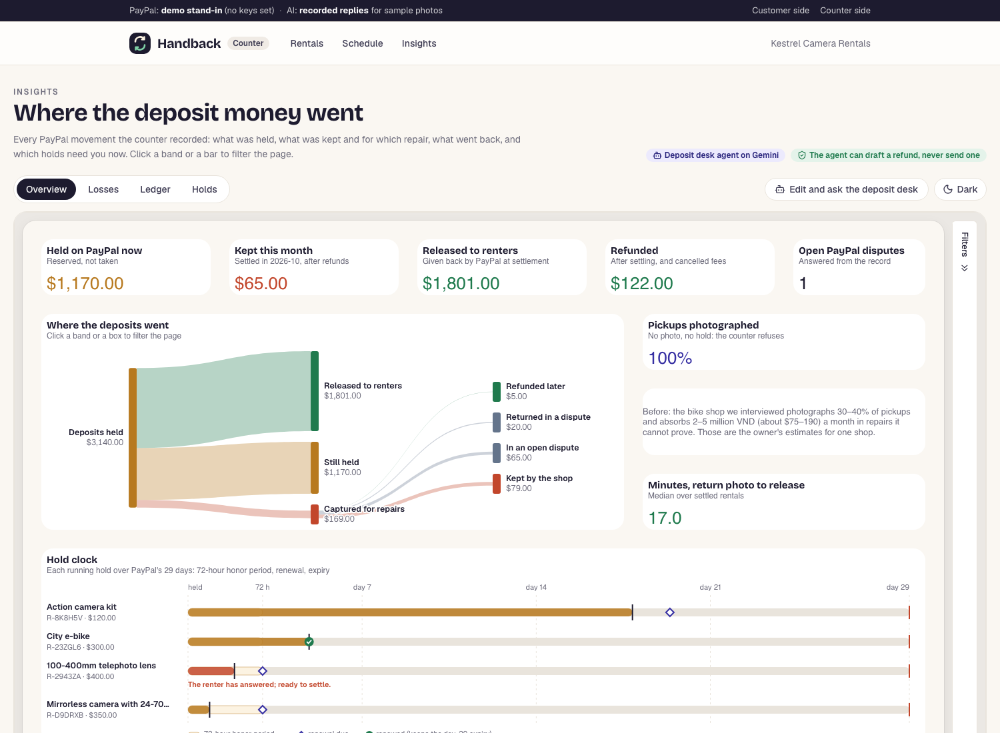
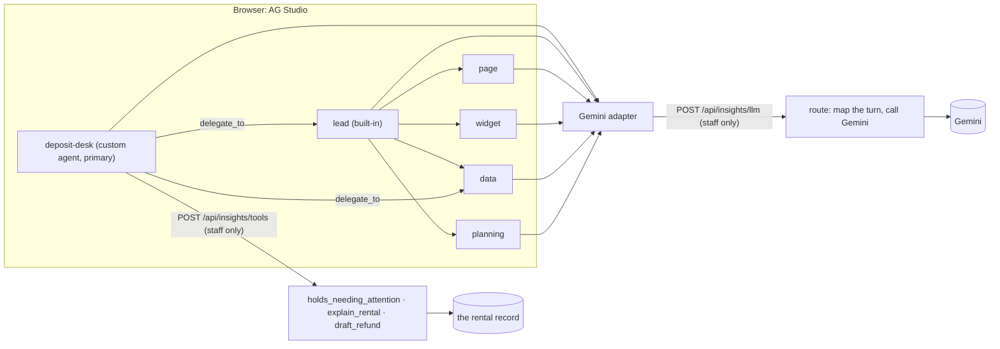
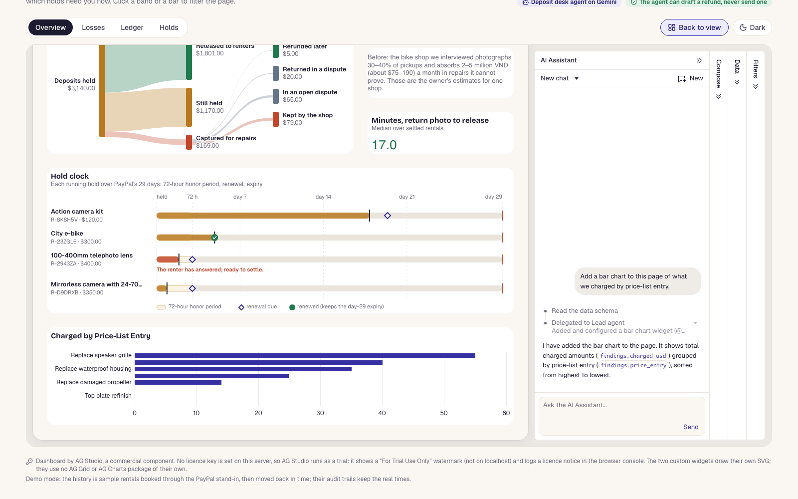
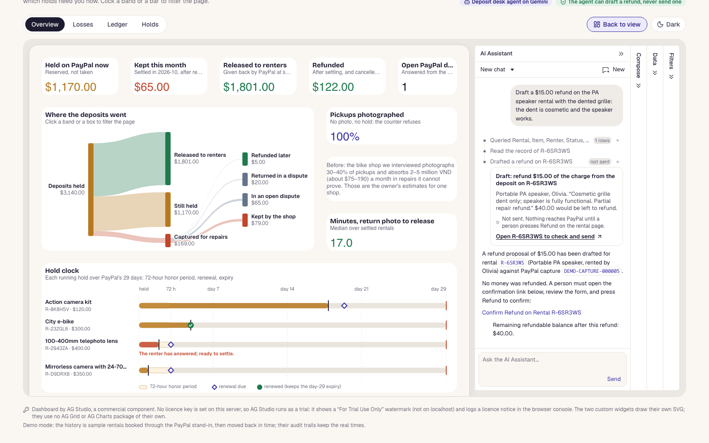

# The owner's dashboard (AG Studio)

The counter has a third page, **Insights** (`/shop/insights`), next to Rentals and Schedule. It answers the questions an owner asks about deposit money that one rental page cannot: where a month of deposits went, what was kept and for which repair, what went back, and which holds need a person now. It is built with [AG Studio](https://www.ag-grid.com/studio/), AG Grid's embedded analytics component, and its Agent Framework.

The bike shop we interviewed absorbs 2 to 5 million VND (about $75 to $190) a month in repairs it cannot prove and photographs only 30 to 40 percent of pickups (the owner's own estimates, for one shop). The dashboard shows the same two things for a Handback shop: every kept dollar next to the price-list entry and the renter's answer behind it, and the share of pickups with a photo on record.

Demo mode on localhost, with the sample history described below.

## What the page shows

Four pages, switched with the tabs above the dashboard. Every widget is an AG Studio widget on Handback's data; two of them are custom widgets of our own.

| Page | Widgets |
|---|---|
| **Overview** | Five KPIs (AG Studio value widgets): held on PayPal now, kept this month (a widget filter on the settled month), released to renters, refunded, open PayPal disputes. **Where the deposits went** (custom). Pickups photographed (the average of a 1/0 field, so it follows the page's filters), next to a text widget with the bike shop's 30 to 40 percent. The median minutes from the return photo to the deposit being settled. **Hold clock** (custom). |
| **Losses** | Kept by item, charged by price-list entry (a widget filter leaves out findings that charged nothing), what happened to each finding (donut: charged after the renter accepted, charged after a question, waived by staff, waived after a question, note only), proposed dollars by the renter's answer, and a grid of every finding. |
| **Ledger** | A list filter on the kind of movement, the net to the shop for the rows shown, the number of movements, and a grid of every PayPal movement with its PayPal id, the id it acts on, the amount in dollars and in integer cents, and PayPal's status. The grid's toolbar exports the rows as CSV (AG Studio's own grid export). |
| **Holds** | The hold clock, the number of holds needing a person, held money by hold state, and a grid of running holds with their authorization ids and why each needs attention. |

Clicking a chart bar, a band of the deposit flow or a row of the hold clock cross-filters the page; the filters panel on the right shows and clears what is applied. **Edit the layout** (or **Edit and ask the deposit desk** when the agent is on) switches AG Studio to edit mode, where widgets can be moved, resized, added and configured. Nothing is saved between visits: the layout is defined in code (`lib/insights/report.ts`) and comes back on reload.

**Light and dark.** A button switches between two colour modes made from Handback's tokens (`app/globals.css`); the first visit follows the system setting and the choice is kept in that browser.

## Where the numbers come from

`lib/insights/load.ts` reads the database in six queries and `lib/insights/model.ts`, a pure function, builds the tables. `lib/insights/studio-data.ts` turns them into AG Studio data sources: one per table, each with a name, a description and field definitions whose descriptions say what every number means. The same descriptions are what Studio's agents read.

| Table | One row per | Notes |
|---|---|---|
| `rentals` | booking that was paid or went further | item, unit, dates, status, renter's first name, fee, deposit held, captured, released, charge above the deposit, refunds, what the shop keeps, pickup photographed (1/0), open disputes |
| `ledger` | PayPal money movement | fee capture, deposit hold, hold renewal, final capture, release of the rest, void, charge above the deposit, refund after settling, cancellation refund, and the dispute fund movements PayPal reported (money held from the shop, released, paid to the renter, dispute fee); PayPal id, the id it acts on, integer cents, signed effect on the shop's balance, PayPal's status |
| `findings` | thing the two Gemini looks found | price-list entry, kind, confidence, what the pricing policy did, proposed cents, staff's decision, the renter's answer, the outcome, charged cents |
| `holds` | running deposit hold | first hold time, 72-hour honor period end, renewal due, renewed at, expiry, days left, state, why it needs attention |
| `timings` | rental | booking to pickup in hours, return photo to settled in minutes |
| `flows` | rental and flow | from and to (deposits held, charged above the deposit, released, captured, still held, refunded later, returned in a dispute, in an open dispute, kept by the shop) and the amount |
| `summary` | (one row) | the median minutes from return photo to settled, the share of pickups photographed, the bike shop's 30 and 40 percent, holds needing attention |

Every table but `summary` joins to `rentals` on `rental_id` (AG Studio relationships), so a filter on an item or a status reaches every widget.

**Money.** Amounts stay integer cents in the builder; each table also carries dollars (cents / 100) because AG Studio formats currency from numbers. What the shop keeps follows the rule the counter's refunds already use (`lib/rentals/refunds.ts`): the counter's refunds, plus the larger of the refunds PayPal reported by webhook and the money a dispute returned, because PayPal may report the same money both ways. The ledger follows the same rule: on a disputed capture, the part of a webhook-reported refund that matches the dispute's payout is listed with a net of 0 and a status that says so, and Refunded leaves it out, so the same dollars count once. A refund of the fee of a rental that went ahead is a fee refund, not a refund after settling. A refund sent to PayPal with no answer yet is listed in the ledger but moves no money. A booking PayPal declined took no fee; one cancelled with a stray hold released all of it.

**Hold timing.** A hold's clock starts at its first authorization. A renewed hold keeps the first one's expiry (measured in the sandbox, [paypal-sandbox-notes.md](paypal-sandbox-notes.md)), so the first hold's time is the expiry minus 29 days. The renewal schedule is the same function the hourly job uses (`renewalDueAt`, now in `lib/rentals/hold-clock.ts`): the day before the item is due back, never before 72 hours. A hold needs attention when it expires within 3 days or has expired, when its renewal was due over an hour ago and has not happened, when the item is overdue, or when the renter has answered and the rental can be settled.

**Personal data.** The loader selects no email, payer address, link token or mandate; renters appear by first name only. A name is free text the renter typed, and the agent's model reads it, so it is reduced to its first run of letters, apostrophes and hyphens, at most 24 characters (`renterFirstName`).

## The two custom widgets

AG Charts' Sankey series is an Enterprise feature, and the AG Studio licence covers Studio's own grid and chart widgets only, so both custom widgets draw their own SVG and import no AG Grid or AG Charts package. They are registered with `createWidgets` from `ag-studio-react` under a **Handback** group in the widget menu, take their fields from data mappings (so they can be pointed at other fields in edit mode, or by the agent), and reuse the value widget's format shape for their titles, because Studio exports no shape builder and its agents need a format shape to configure a widget.

- **Where the deposits went** (`components/insights/deposit-flow-widget.tsx`, layout in `lib/insights/sankey.ts`). Mappings: from, to, amount. Columns by depth, bands sized by money, small nodes given a minimum height so their labels fit. Clicking a band sets a multi-value cross-filter on from and to together; clicking a box filters to everything that reached it. When another widget filters the page, the matching part of each band is drawn solid over a faint full band (`supportsHighlight`).
- **Hold clock** (`components/insights/hold-clock-widget.tsx`). Mappings: hold, label, held at, renewal due, expires, renewed at, needs attention, amount. Every row is one hold on the same 29-day axis, starting at its own first authorization: the shaded 72-hour honor period, a filled bar for the time run so far, a diamond for the scheduled renewal, a check for a renewal that happened, and a red tick at the expiry. Rows that need attention are coral and say why. Clicking a row filters the page to that rental; other widgets' filters fade the rows outside them.

Both widgets set Studio's loading, no-data and incomplete-mapping states, are keyboard reachable, and read Handback's colours from CSS variables that change with the colour mode (`components/insights/insights.css`).

## The deposit desk agent

With `GEMINI_API_KEY` set on the server, the page turns on AG Studio's Agent Framework (`AgStudioAiModule`, `createAiHarness`, `directLlmRunner`). The chat panel appears in edit mode.

- **The harness.** Studio's five built-in agents (lead, planning, data, page, widget) run unchanged, and a custom agent, **deposit-desk**, is the primary one: every conversation starts with it (`components/insights/agent.tsx`).
- **The adapter and the proxy.** AG Studio ships no model adapters. Ours implements `AgLlmAdapter.executeTurn` by posting the turn to `/api/insights/llm`, which validates it with zod, maps it to Gemini's `generateContent` (function declarations from Studio's JSON Schemas, tool choice, JSON output) and maps the reply back to Studio's output items (`lib/insights/gemini.ts`, `lib/insights/llm.ts`). The key stays on the server. The model is `AI_MODEL` or `gemini-3.8-flash`, thinking level low.
- **Thought signatures.** Gemini 3 refuses a replayed function call without the thought signature it came with. We checked this live before building: a call replayed without its signature was refused with a 400 ("Function call is missing a thought_signature"); with the real signature, and with Gemini's documented placeholder, it was answered; parameter schemas with `$defs`, `$ref` and `anyOf` were accepted. Studio keeps the conversation in the browser, so the signature rides inside the call id Studio pairs tool results by, and the server keeps nothing between turns.
- **The desk's own tools** run on the server's record through `/api/insights/tools` (`lib/insights/agent-tools.ts`):
  - `holds_needing_attention`: the running holds, with their clock and why a person should look. Read-only.
  - `explain_rental`: one rental's money (fee, hold, what the final capture took, released, refunds, what was returned through disputes, what the shop keeps after both, what is left to refund, every PayPal id), its findings and their outcomes, its PayPal disputes, and its audit trail with whether the hash chain is intact. Read-only. What the shop keeps comes from the same function as the dashboard's Kept. Audit entries carry ids and amounts only, no free text.
  - `draft_refund`: a refund proposal. The server checks it against the same limits the counter's refund applies before it claims a refund: the rental exists, no PayPal dispute on it is open, it is settled or a booking cancelled after payment, the capture is one the counter may refund, and the amount fits what is left after earlier refunds and money a dispute returned. It lists the rental's earlier refunds (amount, charge, day, state; never the reason someone typed) and warns when the draft has the same amount on the same charge, or the same reason, as one of them. It writes nothing and calls no PayPal API. It returns a link to the rental page with the refund form filled in, and a person presses **Refund** and confirms there, through the existing refund code. The link's amount, charge, reason, rental and expiry (a day) are signed with an HMAC keyed from `STAFF_COOKIE_SECRET` (else the access code, else a key for the process), and the page fills the form in, and says the deposit desk drafted it, only for a signature that checks out (`lib/insights/draft-link.ts`).
- **Delegation.** For "show me" and chart requests the desk delegates to Studio's lead agent, which plans and places widgets with the page and widget agents. In a demo run, "Add a bar chart to this page of what we charged by price-list entry" added and configured a grouped bar chart of `findings.charged_usd` by `findings.price_entry`; that one request took about 17 model turns.
- **In the chat panel**, the desk's tool calls have their own labels, and `holds_needing_attention` and `draft_refund` open to a short card (`aiToolDisplay`); the draft card says the refund was not sent and links to the rental.

### Guardrails

- **Staff only.** The page uses `requireStaffPage`; both routes answer 401 without the staff cookie when `SHOP_ACCESS_CODE` is set, like every counter action. Without a code the counter is open to anyone who can reach it, so the agent then answers only requests from the machine that runs the app (a loopback address, under the same proxy rules as the sign-in limits), and the page says it is off and why.
- **No key in the browser, none in a reply.** The adapter only knows the route. Provider errors are logged and returned with the key cut out wherever it appears.
- **No key, no agent.** Without `GEMINI_API_KEY` the AI module is not loaded, the page says "AI assistant needs a Gemini key", and the route answers 503 with the same sentence. The dashboard works as before.
- **Not a general Gemini endpoint.** A turn must fit what Studio sends. In a demo session the largest turn was 80 KB, with instructions up to 17 K characters, seven to nine tools of 55 K characters together, plain-text answers and no system messages. The route refuses a body over 400 KB (checked against `Content-Length` and while reading), instructions over 40 K characters, tools over 120 K, a response schema over 20 K, more than 400 conversation items or 64 tools, and any other shape, before Gemini is called; a system message in the conversation is left out. Answers are capped at 8,192 tokens.
- **Limits.** 120 model turns per client per 10 minutes, counted by the client address (and the verified staff cookie when the counter has a code, so a made-up cookie buys nothing), and 400 from everyone. Every token Gemini reports counts against 2 million an hour and 10 million a day across everyone; over either, the route answers 429 with when to try again. All counted in the web process.
- **Money moves only through the counter.** No tool can refund, capture, void or cancel. The draft is checked on the server and again, in full, by `refundCharge` when a person sends it.
- **Personal data.** Tool outputs name the renter by first name only and carry no email, link token or text someone typed.

## Demo data

In demo mode, the first visit books twelve sample rentals through the real service, once per database (`lib/insights/seed.ts`): returns settled with damage, two clean returns, a charge the renter questioned and staff waived, a partial refund, a PayPal dispute the shop lost and one still open, a booking cancelled and refunded in full, a renter who answered and can be settled, and three holds still running, one of them renewed. The nightly demo reset seeds the counter, the schedule's two weeks, then this history, in that order.

A real booking cannot start in the past, so each plan is booked 99 days ahead, where no other seed and no test books, walked through its story there (the inspections replay the recorded Gemini replies even when a key is set), and then moved to its days onto a unit that is free for them as the timeline draws them, and for its repair block after them. A damaged return is settled on a unit that no booking holds today, because the schedule agent blocks the unit from the settlement day; the block then moves back with the rental. The PayPal stand-in's holds move back with the database's, so the hourly renewal sees their real age; the seed runs it for the hold that is due, which is how one hold shows as renewed. The schedule's seed rechecks its own moved-back rentals the same way. Running holds use items with spare units and end within three days, so the counter's and the schedule's sample bookings still find units whichever seed runs first; tests run the dashboard's seed before and after the schedule's, with and without the counter's, and check that all of them seed and that nothing shares a unit. A plan that fails part way is undone: its hold voided on the stand-in and its rows deleted. Their audit trails keep the real times. The seed runs only in demo mode, because it books through the PayPal stand-in.

## Tests

- `lib/insights/model.test.ts`: rentals walked through the real service in demo mode, then checked: every settled rental's hold equals what was captured plus what was released; kept plus refunds plus dispute returns equals what was captured, never below zero; no refund above its capture; the ledger's signed sum per rental; one ledger row per PayPal movement with the right ids; a cancelled booking (fee and cancellation refund, no hold); money conserved at every node of the deposit flow; findings, the hold clock and timings; no email, link token or surname in the output. With hand-made records: the renewal schedule, a renewed hold keeping the first expiry, holds near expiry and a missed renewal, money reported both by webhook and as a dispute's outcome counted once, a refund waiting for PayPal, a declined booking, a charge above the deposit.
- `lib/insights/sankey.test.ts`: depth columns, money conserved through nodes, bands stacked without overlap, minimum node heights, ordering and merging.
- `lib/insights/gemini.test.ts`: schema conversion, wrapping non-object tool parameters, history and tool-call mapping, signatures and the placeholder, tool choice and JSON output, refused shapes, reply mapping, cut-off and blocked turns.
- `app/api/insights/routes.test.ts`: both routes staff only; the 503 without a key and the 403 on an open counter from another machine; no key in replies or errors; turns counted per address whatever cookie is sent; bodies and parts larger than Studio's refused before Gemini; the answer cap; the token budget; unknown tools and bad arguments refused; the tools write nothing (row counts and the PayPal stand-in's state unchanged) and name the renter by first name; a draft held to what is left after a refund, refused during an open dispute and before settling, signed, and flagged when it repeats a refund.
- `lib/insights/seed.test.ts`, `lib/insights/seed-failure.test.ts`: the dashboard's seed before the schedule's (alone and after the counter's) and after it (the nightly reset), with all twelve plans seeded, the schedule's count unchanged and no unit shared on a day; the stand-in's clock and the renewal; recorded replies with a key; a failed plan undone.
- `lib/insights/draft-link.test.ts`, `components/refund-form.test.ts`, `lib/insights/agent-tools.test.ts`: signed draft links, the refund form filled in from a draft, and `explain_rental` agreeing with the dashboard.
- `e2e/insights.spec.ts` (demo mode): the KPIs and both custom widgets draw, a click on the deposit flow filters the page, and the Ledger and Holds pages open.
- `e2e/insights-agent.spec.ts` (demo mode): the deposit desk in the browser, through Studio's chat panel and harness, the adapter, the turn route and `holds_needing_attention` on the server, ending on an answer that read the tool's result. The end-to-end server sets `INSIGHTS_AGENT_SCRIPT=e2e`, which answers each turn from a fixed script (`scriptedTurn`) instead of Gemini; it is for that server only.

The agent itself was run by hand against Gemini in demo mode: the three tools, the delegation above, and a refund draft opened on the rental page with the form filled in.

## Licensing

Handback's code stays MIT. AG Studio is commercial software (`ag-studio` and `ag-studio-react` 3.0.0, `"license": "Commercial"`); npm installs it with the project, and the repository contains no AG Studio code. It brings `ag-grid-enterprise` and `ag-charts-enterprise` as its own dependencies, which its licence covers for Studio's built-in grid and chart widgets. Handback's custom widgets import neither, nor any other AG Grid or AG Charts package.

- **Without a licence key**, AG Studio runs as a trial: it shows a "For Trial Use Only" watermark (it hides it on localhost) and logs a licence notice in the browser console. The page says so under the dashboard.
- **With a key**, set `AG_STUDIO_LICENSE_KEY` on the host. The page reads it on the server and passes it to `AgStudioProvider`. A front-end licence key reaches the browser by design, so it is not a secret, but it is never committed. With the agent on, the key must include AG Studio's AI features.
- Anyone running Handback beyond evaluation needs their own AG Studio licence.

## Files

- `app/shop/insights/page.tsx`: the page, staff only; seeds demo data, builds the data, passes the licence key.
- `components/insights/insights-board.tsx`: page tabs, edit and colour-mode buttons; loads Studio with `next/dynamic` and `ssr: false`, so its code ships with this page only.
- `components/insights/studio.tsx`: `AgStudioProvider`, `AgStudio`, the custom widget definitions, panels.
- `components/insights/theme.ts`, `components/insights/insights.css`: the theme in two colour modes.
- `components/insights/deposit-flow-widget.tsx`, `components/insights/hold-clock-widget.tsx`: the custom widgets.
- `components/insights/agent.tsx`: the adapter, the deposit desk, its tools and their chat display.
- `lib/insights/`: `load.ts`, `model.ts`, `studio-data.ts`, `report.ts`, `sankey.ts`, `seed.ts`, `gemini.ts`, `llm.ts`, `agent-tools.ts`, `draft-link.ts`, `registry.ts`; `lib/schedule/place.ts` places a rental whose days are already decided.
- `app/api/insights/llm/route.ts`, `app/api/insights/tools/route.ts`: the two staff-only routes.

## Known limits

- The layout and anything the agent adds are not saved; a reload starts from the layout in code.
- The data is loaded when the page renders. New PayPal movements appear on reload, not live.
- Turn limits and the token budget live in the web process, like the rest of the app's limits; a restart resets them.
- The agent drafts refunds only. It cannot answer a dispute, settle, or renew a hold; those stay on the counter's pages and in the hourly job.
- "Kept this month" and the timings use UTC months and server times, like the rest of Handback.
- The demo history's audit trails show the time the seed ran, not the moved-back times.
