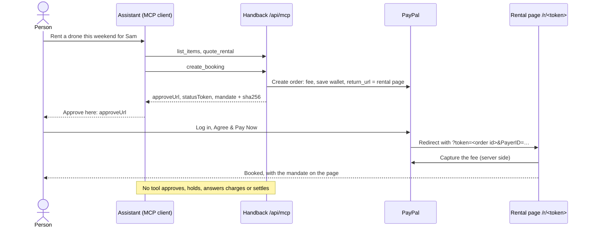

# Booking through an assistant

Handback runs an MCP server at `/api/mcp`. A person can ask their assistant, in Claude Desktop, Claude Code or any other MCP client, to "rent a drone this weekend for Sam". The assistant finds the item, gets a quote and starts the booking. It ends by handing the person a PayPal approval link.

The assistant never moves money. The person approves the rental fee in PayPal themselves. Every later step that touches money happens at the shop's counter: holding the deposit at pickup, and settling after the renter has answered each proposed charge on their own page. The assistant is never given that page; it follows the rental with a status token that can only read.

## What an assistant can do

| Tool | What it does | Changes anything |
|---|---|---|
| `list_items` | The rental items with daily rate, deposit hold and what comes in the box, plus today's date at the shop | No |
| `quote_rental(itemId, startDate, endDate)` | The fee paid at booking, the deposit held at pickup, the repair price list, and the terms the renter will agree to, cancellation terms included. Amounts are computed by the server (`quoteRental` in `lib/rentals/service.ts`); pickups can be at most 120 days ahead | No |
| `create_booking(itemId, startDate, endDate, name, email, assistant?)` | Creates an unpaid booking, its deposit mandate and a PayPal order for the fee. Returns the rental id, `approveUrl` (PayPal's `payer-action` link, for the renter), `statusToken` (for `get_rental_status`), the mandate and its SHA-256 | Creates an unpaid draft. No money moves |
| `get_rental_status(statusToken)` | Status, what is paid, held, kept, released or refunded, any proposed charges waiting for the renter, and a cancellation with its fee refund and where PayPal is with it. Takes the `statusToken` from `create_booking`; the renter's page token does not work here | No |

There is no tool to approve a payment, cancel a booking, hold a deposit, accept or question a charge, or settle, and no reply contains the renter's page link: PayPal opens that page for the renter after they approve. The renter cancels there, and the status token does not work as that page's token. Tool annotations say the same thing to clients: the three read tools are `readOnlyHint: true`, and `create_booking` is `destructiveHint: false, idempotentHint: false` (each call creates a new booking).

## Where money moves

1. **Booking.** The renter opens `approveUrl`, logs in to PayPal and approves. PayPal captures nothing yet. It sends the renter back to their rental page, where the server captures the fee (Orders v2 `intent: CAPTURE`) and PayPal saves the wallet for this shop (Vault, `store_in_vault: ON_SUCCESS`). If the renter closes the window first, PayPal's `CHECKOUT.ORDER.APPROVED` webhook starts the same capture.
2. **Pickup.** The counter photographs the item and holds the deposit on the saved wallet (`intent: AUTHORIZE` with the vault id; the renter is not present). The hold is checked against the mandate first.
3. **Return.** Two AI looks compare the photos and propose charges from the mandate's price list; staff keep or waive each one. The renter accepts or questions every kept charge on their own page.
4. **Settlement.** The counter settles: one final capture of the charges, and PayPal releases the rest of the hold. Every charge is checked against the mandate first.
5. **Cancelling, before pickup.** The renter can cancel on their own page and gets back the share of the fee the mandate's cancellation terms give at that moment, as a Payments v2 refund of the fee capture. The counter can cancel too, refunding any amount up to the fee. No tool cancels, and get_rental_status reports the cancellation and its refund.



## Connecting a client

The endpoint is `https://<your deployment>/api/mcp`, or `http://localhost:3000/api/mcp` when running locally (`npm run dev`). It speaks Streamable HTTP in stateless mode: requests are answered with plain JSON rather than an event stream, there are no sessions, and `GET` and `DELETE` return 405. There is no authentication, the same as the public booking form, because all a caller can create is an unpaid draft.

**Claude Code**

```sh
claude mcp add --transport http handback http://localhost:3000/api/mcp
```

**Claude Desktop**, through the `mcp-remote` stdio bridge, in `claude_desktop_config.json`:

```json
{
  "mcpServers": {
    "handback": {
      "command": "npx",
      "args": ["-y", "mcp-remote", "http://localhost:3000/api/mcp"]
    }
  }
}
```

Clients that take a remote MCP URL directly can use the deployment's HTTPS URL instead.

**MCP Inspector CLI**

```sh
npx @modelcontextprotocol/inspector --cli http://localhost:3000/api/mcp --transport http --method tools/list
```

**Your own code**, with the TypeScript SDK:

```ts
import { Client } from "@modelcontextprotocol/sdk/client/index.js";
import { StreamableHTTPClientTransport } from "@modelcontextprotocol/sdk/client/streamableHttp.js";

const client = new Client({ name: "my-assistant", version: "1.0.0" });
await client.connect(new StreamableHTTPClientTransport(new URL("http://localhost:3000/api/mcp")));
const quote = await client.callTool({ name: "quote_rental", arguments: { itemId: "drone-kit", startDate: "2026-10-10", endDate: "2026-10-12" } });
```

Three of these were run against the app: the `mcp-remote` bridge, launched through the SDK's stdio client the way Claude Desktop launches it; the Inspector CLI; and the SDK client, in the tests and scripts. The Claude Code command follows `claude mcp add --help`.

The server's `instructions` tell the assistant the shop's date and the rule above. A browser on another site cannot call the endpoint: requests whose `Origin` is not the app's own are refused (the MCP transport spec asks servers to check `Origin` against DNS rebinding). Clients that run outside a browser send no `Origin` and are unaffected.

## The demo client

`scripts/agent-books.ts` connects to the endpoint with the MCP SDK and gives a plain request to a model with the server's tools. It uses Claude (`claude-opus-5-5`, through the Anthropic SDK's tool runner and its MCP helpers) when `ANTHROPIC_API_KEY` is set, and Gemini function calling otherwise.

```sh
npm run agent:book -- "rent a drone this weekend for Sam, sam@example.com"
```

A run against the PayPal sandbox with Gemini:

```
-> list_items {}
-> quote_rental {"itemId":"drone-kit","startDate":"2026-10-03","endDate":"2026-10-04"}
-> create_booking {"startDate":"2026-10-03","name":"Sam","endDate":"2026-10-04","email":"sam@example.com","itemId":"drone-kit","assistant":"Gemini"}

I have booked the Folding camera drone kit for you for this weekend (pickup October 3, return October 4, 2026).

Rental fee: $45.00 (paid when you approve in PayPal)
Deposit hold: $300.00 (held on your PayPal account at pickup)

Please approve your payment here:
https://www.sandbox.paypal.com/checkoutnow?token=7PN16640LG248603E
```

The script then prints the approval link, the status token and the full mandate. In this run the sandbox buyer approved the link afterwards and the fee was captured (capture `2XN89951BX6742945`; see `docs/paypal-sandbox-notes.md`).

## The deposit mandate

Every booking, from an assistant or from the website, gets a deposit mandate. It writes down what the renter lets the shop do with their PayPal account. It borrows the idea of AP2's mandates (a scoped, expiring, hashable statement of what may be charged). It is not an AP2 implementation, is not signed, and is not sent to PayPal. Approving the booking in PayPal is how the renter agrees to it: the booking form says so next to the PayPal button, and an assistant gets the terms from `quote_rental` and `create_booking` to show the person before they approve. PayPal's own approval page shows PayPal's consent text for saving the wallet.

| Field | Meaning |
|---|---|
| `rentalId`, `shop`, `item`, `renter` | Which rental, at which shop, for whom |
| `issuedTo` | `{ "party": "renter" }` for a web booking; `{ "party": "assistant", "assistant", "actingFor" }` when an assistant booked. The assistant's name is self-reported: in stateless mode the server never sees the client's `initialize` request, so it cannot read the client's name |
| `period` | Pickup and return dates, number of days |
| `feeCents` | The rental fee, captured when the renter approves in PayPal |
| `hold` | `maxCents`, the most the shop may hold, starting `at_pickup` |
| `charges` | The rules the code applies: amounts only `from` the `price_list`, `onlyAfter` the charge was `shown_to_renter`; an `accepted` charge is `charged`; a `questioned` one is decided by the shop (`shop_decides`); anything `aboveHold` goes to the `saved_paypal` wallet |
| `priceList` | The repair price list at the time of booking. The return inspection prices findings from this list, so later changes to the shop's prices do not apply to this rental |
| `expiresAt` | 29 days after the scheduled pickup date, the life of a PayPal authorization placed at pickup. Nothing can be held or charged under the mandate after it. Rentals last at most 21 days, so this leaves at least 8 days after the scheduled return to settle; a late pickup does not move it |
| `createdAt` | When it was issued |
| `cancellation` | Version 2 only. `feeRefund`: the share of the fee (`percent`) refunded when the renter cancels `before` each moment, earliest first, fixed from the shop's policy (`CANCELLATION_POLICY` in `lib/shop.ts`) to this booking's pickup day in UTC. From the last moment, the start of the pickup day, nothing. Cancelling uses these terms, so a later change to the policy does not reach the booking |

Bookings made since the cancellation terms were added get version 2; earlier ones keep version 1, which has no `cancellation` field. Their stored text is never rewritten and still verifies against its hash, and cancelling one applies the shop's policy as it is now to its pickup day. Here is the test fixture from `lib/rentals/mandate.test.ts` (its price list is shorter than a real one):

```json
{
  "type": "handback.deposit-mandate",
  "version": 2,
  "rentalId": "R-TEST01",
  "shop": { "name": "Kestrel Camera Rentals", "city": "Austin, TX" },
  "item": { "id": "drone-kit", "name": "Folding camera drone kit" },
  "renter": { "name": "Sam Rivera", "email": "sam@example.com" },
  "issuedTo": { "party": "assistant", "assistant": "Claude", "actingFor": "Sam Rivera <sam@example.com>" },
  "period": { "pickup": "2026-10-03", "return": "2026-10-05", "days": 2 },
  "currency": "USD",
  "feeCents": 9000,
  "hold": { "maxCents": 30000, "starts": "at_pickup" },
  "charges": { "from": "price_list", "onlyAfter": "shown_to_renter", "accepted": "charged", "questioned": "shop_decides", "aboveHold": "saved_paypal" },
  "priceList": [
    { "id": "missing-battery", "label": "Replace flight battery", "kind": "missing", "cents": 8900 },
    { "id": "propeller-damage", "label": "Replace damaged propeller", "kind": "damage", "cents": 1400 }
  ],
  "expiresAt": "2026-11-01T00:00:00.000Z",
  "createdAt": "2026-10-02T12:00:00.000Z",
  "cancellation": {
    "feeRefund": [
      { "before": "2026-10-02T00:00:00.000Z", "percent": 100 },
      { "before": "2026-10-03T00:00:00.000Z", "percent": 50 }
    ]
  }
}
```

**Hash.** The stored text is canonical JSON: object keys sorted, no whitespace (`canonicalJson` in `lib/rentals/audit.ts`). Its SHA-256 is stored next to it on the rental (`mandate_json`, `mandate_sha256`) and goes into the audit chain as the `mandate.issued` event, so the chain commits to it. The fixture above hashes to `5421facd22f49cb95452e5202c11fde1983ae35dfdfb77df06d2b93c9a8f05ac`; a test pins that value. The same booking as a version 1 mandate (`"version": 1`, no `cancellation`) hashes to `5231c681c64edc9fa0a394faadc306c5e5ab3e6d4fb3a8d9086518f0c3887974`, the value pinned before version 2, and another test checks that it still opens as intact. To check a mandate yourself, save its JSON and run:

```sh
node -e 'const c=v=>Array.isArray(v)?`[${v.map(c)}]`:v&&typeof v=="object"?`{${Object.keys(v).sort().map(k=>JSON.stringify(k)+":"+c(v[k]))}}`:JSON.stringify(v);process.stdout.write(c(JSON.parse(require("fs").readFileSync(0,"utf8"))))' < mandate.json | shasum -a 256
```

**Where it shows up.** `create_booking` returns it to the assistant. The renter's page shows it in plain sentences, with the price list and the exact JSON with its hash: open before payment, folded away afterwards. The page PayPal's cancel link leads to shows it open, next to the way back to PayPal. The timeline records who it was issued to.

**What enforces it.** `holdDeposit` and `settle` check it before calling PayPal (`mandateViolations` in `lib/rentals/mandate.ts`). They refuse a hold above `maxCents`, a charge whose price-list entry or amount differs from the mandate's, a charge the renter has not answered, and anything after `expiresAt`. They refuse everything when the stored mandate is not the one recorded in the audit chain at booking: edited, re-sealed with a new hash, swapped for another rental's, or removed. They also refuse when the rental's audit chain no longer verifies (`firstBrokenLink` in `lib/rentals/audit.ts`), so editing the hash recorded at booking does not help either, even with that entry re-hashed. A refusal is written to the audit log as `mandate.refused`. Giving a deposit back never needs the mandate. Cancelling reads the mandate's cancellation terms (`termsFor` in `lib/rentals/cancel.ts`) for what the renter gets back, but only from a mandate that passes the same check (`mandateOnRecord` in `lib/rentals/mandate.ts`); otherwise it applies the shop's policy as it is now to the pickup day. The counter may refund any amount up to the fee.

## Approval by redirect

An assistant's booking is approved on PayPal's site rather than with the JS SDK button, so the booking order sets `experience_context.return_url` to the renter's page, `/r/<token>`, and `cancel_url` to `/paypal/cancelled`, which carries no rental token. PayPal's cancel link can be followed by anyone who opens the approval link, the assistant included, so the page it leads to shows the terms and the way back to PayPal and nothing that acts on the rental. Only approving the payment in PayPal leads to the renter's page. In the sandbox, PayPal came back with:

- on approval: `/r/<token>?token=<order id>&PayerID=<payer id>&ba_token=<billing agreement token>`;
- on cancel: the cancel URL with `?token=<order id>` added (`&token=<order id>` when the URL already has a query).

When the `token` matches the rental's order, a `PayerID` is present and the rental is still unpaid, the page captures the booking on the server through `confirmBooking`, the same function the in-page button uses. It then redirects to the clean URL, so a reload changes nothing. `confirmBooking` moves a rental from unpaid to booked only once, even when two requests race. If the renter approves and closes the window instead, PayPal's `CHECKOUT.ORDER.APPROVED` webhook runs the same `confirmBooking` for that order (its resource is the order, with no capture and no saved-wallet token, so it cannot book the rental by itself); every path sends the capture with `PayPal-Request-Id: booking-capture:<rental id>`, so PayPal captures once. Every link that leads to the return URL is a plain anchor rather than a Next.js `Link`, so the framework never prefetches it and triggers a capture. A cancel lands on `/paypal/cancelled`, which finds the booking by its order id, says nothing was charged and offers the PayPal button again, with the mandate. If PayPal refuses the capture, the rental stays unpaid and the page moves to `?paypal=failed`, where it explains the refusal from the audit log; for example, PayPal answers `ORDER_NOT_APPROVED` when the return URL is opened before approval. Either way the page leaves PayPal's URL, so neither a reload nor a live update runs the capture again; the renter retries through PayPal.

PayPal can accept a capture and leave it `PENDING`. The rental then keeps the capture id, records `booking.pending` and stays unpaid, and the page says PayPal is still processing the payment, with no pay button; a reload or the in-page button does not capture again. PayPal's `PAYMENT.CAPTURE.COMPLETED` webhook for that capture books the rental, and `PAYMENT.CAPTURE.DENIED` cancels it with nothing charged. This path is covered by tests with a stubbed gateway; we have not seen the sandbox return a pending booking capture.

PayPal expects the payer to be sent to the approval link within 6 hours of creating the order (the default in the Orders v2 schema), so assistants should book when the person is ready to approve.

In demo mode (no PayPal keys) the approval link opens `/demo/paypal`, a page labelled as a stand-in for PayPal. It sends the renter back the same way, so the same capture code runs. Unlike PayPal it asks for no login, so in demo mode anyone with the approval link can approve and land on the renter's page.

## Tests and checks

- `lib/mcp/server.test.ts`: the SDK client talks to the HTTP handler in demo mode. It covers the tool list and annotations, quotes (with the cancellation terms), errors the assistant can act on, a booking that moves no money, status through to settlement by status token, a cancellation reported with its refund while no tool and no status token can cancel, replies that never contain the renter's token, the renter's token refused as a status token, and the `Origin` check.
- `lib/rentals/mandate.test.ts`: mandate contents, a pinned hash, key-order independence, tamper detection and the enforcement rules.
- `lib/rentals/service.test.ts`: the mandate on web and assistant bookings, blocked charges, pricing from the mandate, the redirect return (approve, reload, two returns, the in-page button and the `CHECKOUT.ORDER.APPROVED` webhook at once, the webhook alone, a pending capture completed or denied by webhook, a cancel URL without the renter's token, a PayPal refusal).
- `e2e/agent-booking.spec.ts`: Playwright books over MCP and checks that no reply leads to the renter's page. A phone leaves the demo stand-in once, reads the mandate on the cancel page, approves, and lands booked on its own page, whose token the status tool refuses.
- `scripts/sandbox-agent-booking.ts`: the same against the real PayPal sandbox as the sandbox buyer. It can also run the rental through the counter to a final capture. Results are in `docs/paypal-sandbox-notes.md`.

## Limits

- The counter pages under `/shop` show each rental's renter link and the buttons that hold, decide on, settle and refund a deposit, and cancel a booking. A rental id, which `create_booking` returns and the renter's page shows, opens that rental there. With `SHOP_ACCESS_CODE` set they, and the counter's server actions, need the staff cookie from `/shop/sign-in`; without it (local runs, clones) they are open to whoever can reach them. It is one shared code, not staff accounts. The MCP endpoint, the booking pages and the renter pages are the parts meant for the public.
- The renter's page is a bearer link: whoever has `/r/<token>` can do there what the renter can, including answering charges. PayPal opens it for whoever approves the payment, which takes the payer's PayPal login (in demo mode, no login).
- The endpoint has no rate limit. Anyone can create unpaid drafts, as with the booking form.
- The assistant's name in the mandate is whatever it says it is.
- The mandate is hashed, and holds and charges are checked against the hash the audit chain recorded at booking and against the chain itself, but nothing is signed. Someone with write access to the database could still rewrite the mandate together with every audit entry from the booking on. A copy of the hash kept outside the database, such as the one the assistant received from `create_booking`, is what would show the change.
- Because a broken chain stops holds and charges, so would a chain broken by accident. Entries are appended without a per-rental lock, so two written for the same rental at the same instant could both point at the same previous entry. The page would then show the chain as broken, and the counter could not hold or charge under the mandate until someone looked; releasing the deposit would still work.
- A booking capture that PayPal leaves `PENDING` is resolved only by PayPal's webhooks, so a deployment without `PAYPAL_WEBHOOK_ID` keeps such a rental unpaid. If PayPal returned no saved-wallet token with the pending capture, the counter cannot hold the deposit on a saved wallet later.
- A renter who approves in PayPal but closes the window before PayPal sends them back is booked only by the `CHECKOUT.ORDER.APPROVED` webhook, so a deployment without `PAYPAL_WEBHOOK_ID` keeps them unpaid. The webhook path is tested against PayPal's simulated payload and the demo stand-in; no real delivery has reached a deployment yet.
