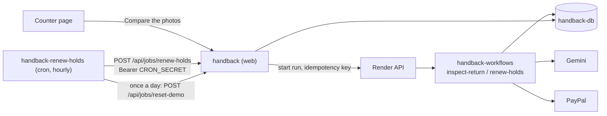

# Deploying Handback on Render

Handback deploys to Render from one Blueprint (`render.yaml`): the Next.js app, a Render Postgres database, a Render Workflows service for the slow and retry-worthy work, and an hourly cron job. This page covers the steps, what it costs, how to keep it running through judging (until Dec 15, 2026), and what has been verified so far.

## What the Blueprint creates

| Name | Type | Plan | What it does |
|---|---|---|---|
| `handback` | Web service, Node 22 | `0.5c-512mb` (Starter), $7/month | The app: counter, customer pages, PayPal webhooks, `/api/health` |
| `handback-db` | Render Postgres 18 | `0.1c-256mb` (Basic 256 MB), $6/month, 1 GB disk | Rentals, photos, audit log. Reachable only from Render services in the same region |
| `handback-workflows` | Render Workflows | per task run (`flex`) | Two tasks: `inspect-return` and `renew-holds` |
| `handback-renew-holds` | Cron job | `0.5c-512mb`, per second, $1/month minimum | Every hour at :17 UTC, asks the web service to renew deposit holds that are due; once a day it also asks for the [daily demo reset](#daily-demo-reset), which the web service runs only with `DEMO_RESET=true` |

Every resource is in `oregon`, so the services reach the database and each other over Render's private network.

The plans are paid on purpose. A free web service sleeps after 15 minutes without traffic and takes about a minute to wake, and a free Postgres database expires 30 days after it is created (then is deleted after a 14-day grace period). Both would fail before judging ends on Dec 15.

## How the pieces work together



- **Photo inspection.** "Compare the photos" starts an `inspect-return` run with the rental id and waits for it. The task loads both photos from Postgres, asks Gemini for two independent looks, applies the deterministic price policy and the agreement rule, and saves the assessment. It is the same `inspect()` the app runs without Render (`lib/rentals/service.ts`); `lib/workflows/jobs.ts` only wraps it. Timeout 3 minutes, two retries (5 s, then 10 s).
- **Idempotency.** The run is started with the key `inspect-<rental id>-<failed runs so far>`. Render returns the existing run for a key it has seen in the last 24 hours, so a double tap or a second tab joins the run already going. Keys are scoped to a workflow version, so after a deploy a second press starts a new run; the row lock in `inspect()` still leaves one assessment. A failed run is written to the rental's audit log, and the next press uses a new key. Inside the task, a retry that finds the comparison already saved returns it, and `inspect()` locks the rental row, so two racing runs leave one assessment.
- **Hold renewal.** Render Workflows has no scheduler yet, so the cron job calls `POST /api/jobs/renew-holds`, which starts a `renew-holds` run keyed by the hour (`renew-holds-2026-11-20T09`). The task calls `renewDueHolds()` from `lib/rentals/jobs.ts`: a hold is renewed the day before the item comes back, never before day 4, at most once. The cron job goes through the web service rather than calling Render itself so that one place decides where a job runs, and so the cron job needs only `CRON_SECRET`, not a Render API key.
- **Without Render Workflows.** With no `RENDER_API_KEY`, with `RENDER_WORKFLOWS=off`, or when the Render API cannot be reached, the same functions run inside the web process. Local development, demo clones and the test suite never need Render.
- **Demo mode.** The PayPal stand-in keeps its state in the web process, so in demo mode the web service always renews holds itself; the `renew-holds` task refuses to touch the stand-in from another process. Inspections run on Workflows in either mode.
- **Same modes on both services.** The web service and the workflow each get their own PayPal and Gemini values (step 2 below), so they can disagree. The web service sends its PayPal and AI modes with every run. An `inspect-return` run whose AI mode differs, or a `renew-holds` run whose PayPal mode differs, does nothing and returns `{"status":"skipped","reason":...}`. The web service then does the work itself, with the settings `/api/health` reports, logs the reason, and shows the run under `jobs.lastSkippedRun` in `/api/health` (the latest one since the web service started). After a skipped renewal sweep the cron job also exits non-zero, so Render notifies you. Either way, fix the workflow's values.

## Before you start

- A Render account. The free Hobby workspace is enough; the services themselves are paid, so add a card or the hackathon's Render credits (offered on the hackathon's Devpost page).
- The repository on GitHub. Render builds from it.
- A PayPal sandbox REST app (developer.paypal.com, Apps & Credentials, Sandbox) with Vault (save payment methods) turned on, and a sandbox Personal account to pay with. Without them the app runs on the PayPal stand-in.
- A Gemini API key. Without it, inspections replay recorded Gemini replies for the bundled sample photos only.
- A Render API key (Account Settings, API Keys). The web service uses it to start task runs; without it every job runs in the web process. A Render API key can manage every service in your workspaces, so treat it like a password.

## Deploy

1. In the Render Dashboard choose **New**, then **Blueprint**, and connect the repository. Render reads `render.yaml` from the repository root. (Or use the button at the end of this page.)
2. Fill in the values Render asks for. They are marked `sync: false` in `render.yaml`, so they never live in the repository.

   | Service | Variable | Value |
   |---|---|---|
   | `handback` | `PAYPAL_CLIENT_ID`, `PAYPAL_CLIENT_SECRET` | Sandbox app credentials. Leave both empty for the demo stand-in |
   | `handback` | `GEMINI_API_KEY` | Gemini key, or empty for recorded replies |
   | `handback` | `PAYPAL_WEBHOOK_ID` | Leave empty; set it after the first deploy (below) |
   | `handback` | `APP_URL` | Leave empty unless you add a custom domain; the app uses `RENDER_EXTERNAL_URL` |
   | `handback` | `RENDER_API_KEY` | Your Render API key, or empty to keep jobs in the web process |
   | `handback` | `SHOP_ACCESS_CODE` | A random code of at least 12 characters, for example from `openssl rand -base64 12`. Staff enter it at `/shop/sign-in`; without it anyone who finds the URL can hold, settle and refund, and a shorter one closes the counter to everyone. Changing it signs every browser out |
   | `handback` | `PUBLIC_DEMO` | `true` on the copy judges use, so the sign-in page says the code is in the Devpost testing instructions; empty otherwise |
   | `handback` | `DEMO_RESET` | `true` only on the copy judges use: once a day it **deletes every rental** and seeds the sample ones again ([Daily demo reset](#daily-demo-reset)). Empty everywhere else |
   | `handback-workflows` | `PAYPAL_CLIENT_ID`, `PAYPAL_CLIENT_SECRET`, `GEMINI_API_KEY` | **The same values** as the web service. A task whose mode differs skips its work and the web service does it instead (see "Same modes on both services") |

   If the form does not show the workflow's fields, add them under `handback-workflows`, **Environment**, after the Blueprint is created.

   Render fills in the rest: `DATABASE_URL` (internal connection string), a random `CRON_SECRET` and `STAFF_COOKIE_SECRET`, `RENDER_WORKFLOW_SLUG` (from the workflow service), the cron job's `HANDBACK_HOSTPORT`, `CRON_SECRET` and `DEMO_RESET_HOUR` (from the web service), `DEMO_RESET_HOUR=20`, `PAYPAL_ENVIRONMENT=sandbox` and `NODE_VERSION=22`.
3. Apply. The web service builds with `npm ci && npm run build` and starts with `npm run start`; it goes live once `GET /api/health` answers 200, which needs the database. The workflow service builds with `npm ci`, then runs `npm run workflows` to register its tasks: its **Tasks** page should list `inspect-return` and `renew-holds`. After the web service's first successful deploy, Render runs `npm run seed:demo` once (`initialDeployHook`).
4. If your workspace cannot create a workflow from a Blueprint, delete the `handback-workflows` service and the `RENDER_WORKFLOW_SLUG` entry from `render.yaml` before applying it. Then create the workflow by hand: **New**, **Workflow**, this repository, language Node, region Oregon, build command `npm ci`, start command `npm run workflows`, with `DATABASE_URL` (the database's internal URL), `NODE_VERSION=22` and the PayPal and Gemini values from step 2. Finally set `RENDER_WORKFLOW_SLUG` on `handback` to the workflow's slug, shown on each task's page as `<slug>/<task>`.

Before changing `render.yaml`, check it with `render blueprints validate` (Render CLI, after `render login`). The file in this repository passes Render's published schema (`https://render.com/schema/render.yaml.json`).

## After the first deploy

### Register the PayPal webhook

PayPal delivers webhooks only to public HTTPS on port 443, so this needs the deployed URL.

```bash
# From your machine, with the sandbox credentials in .env.local:
npm run paypal:webhook -- https://handback.onrender.com
# or from the Shell tab of the handback service, which knows its own URL:
npm run paypal:webhook
```

It prints `PAYPAL_WEBHOOK_ID=...` (or finds the webhook already registered for that URL). The webhook subscribes to `CHECKOUT.ORDER.APPROVED` (books a renter who approved and closed the window before PayPal sent them back), the `PAYMENT.CAPTURE.*` events including `REFUNDED`, the two `PAYMENT.AUTHORIZATION.*` events, the three `CUSTOMER.DISPUTE.*` events and the two vault token events. For a URL registered before `CHECKOUT.ORDER.APPROVED` was on the list, running the command again adds the missing event types. Set `PAYPAL_WEBHOOK_ID` on the `handback` service under **Environment**; Render redeploys, and `/api/health` then shows `"webhookConfigured": true`. Until then `POST /api/paypal/webhooks` answers 503, because it refuses events it cannot verify.

### Seed the counter

`scripts/seed-demo.ts` walks six rentals through the real rental service to six different steps: booked, out, needs review, with the customer, settled with nothing kept, and settled with an accepted $55 charge. Each rental is found by its customer's `@example.com` address and only the missing steps run, so running it again changes nothing.

- **Demo mode:** the first-deploy hook already did it. The stand-in plays the customer.
- **Sandbox:** a script cannot approve a PayPal checkout, so the seed pays each booking fee with a wallet saved at a real booking, and the audit log says so. Book one rental through the site with your sandbox buyer (the PayPal button saves the wallet), then run this in the `handback` Shell tab:

  ```bash
  SEED_VAULT_ID=latest npm run seed:demo
  ```

  Without `SEED_VAULT_ID` the seed creates nothing and explains why. It refuses live PayPal.

In demo mode the stand-in caches its state in the web process: if you seed after the web service has already booked or held something, restart it.

### Smoke test

1. `curl -s https://handback.onrender.com/api/health` should show `"ok": true`, `"driver": "postgres"`, the PayPal and AI modes you chose, `"runner": "render-workflows"` and the commit you deployed. The modes are the web service's; the workflow's are checked on each run, and `"lastSkippedRun"` stays `null` while they agree (check it again after steps 3 and 5).
2. Open `/shop`: it sends you to `/shop/sign-in`; enter `SHOP_ACCESS_CODE`, and the seeded rentals are grouped by step. `curl -s -o /dev/null -w "%{http_code}" https://handback.onrender.com/api/live/shop` should answer 401. In `/api/health`, `staffAccess.mode` should be `code`, and `staffAccess.countedAs` should be your own public address (compare with what an IP lookup site shows). If it is an address of Cloudflare or Render instead, set `TRUSTED_PROXY_HOPS=1` (or more, one per extra proxy) and check again: wrong codes are counted against that address.
3. Run one rental end to end with two screens: `/rent` on a phone (pay with the sandbox buyer), `/shop` on a laptop. Take the pickup photo, hold the deposit, take the return photo, press **Compare the photos**. The audit trail should say "Render Workflows" next to "Two AI looks compared the photos".
4. In the dashboard, `handback-workflows`, **Tasks**, `inspect-return`, **Runs**: the run has input `["R-…", {"paypal":"sandbox","ai":"gemini"}]` and result `{"status":"inspected"}`.
5. Trigger the cron job once (`handback-renew-holds`, **Trigger Run**). The log should end with `HTTP 200 {"ok":true,"ranOn":"render-workflows",...}`. In demo mode it says `"ranOn":"web"`.
6. After settling a sandbox rental, the audit trail gains "PayPal confirmed by webhook" once PayPal delivers `PAYMENT.CAPTURE.COMPLETED`.
7. Refund a few dollars of that rental from its **Refunds** form. The audit trail shows PayPal's refund id, and once PayPal delivers `PAYMENT.CAPTURE.REFUNDED` another "PayPal confirmed by webhook" entry follows; the refund is still counted once.
8. On the judges' copy, with `DEMO_RESET=true`: `/api/health` shows `"demoReset": {"enabled": true, "hourUtc": 20, "refused": null, ...}`, and the counter and the booking page show when the demo starts over. After the next reset hour, the cron run's log ends with `Demo reset: HTTP 200 {"ok":true,"status":"reset",...}` and `lastResetAt` is set.

## Daily demo reset

Judges use the public copy for weeks, as renter and as staff. Without a reset, every earlier visitor's half-finished rental stays on the counter and the next judge cannot tell which rental is theirs. With `DEMO_RESET=true` on `handback`, the copy starts over once a day.

**It destroys all rental data.** Turn it on only on the public demo, never on a copy whose rentals matter. Anyone in the middle of a rental at that moment loses it, and their link stops working.

On the cron job's run in the `DEMO_RESET_HOUR` (UTC, default `20`: 3:00 in Vietnam, noon or 1 p.m. in California; the run starts at :17):

1. After renewing holds, the cron job calls `POST /api/jobs/reset-demo` with the same `CRON_SECRET`. The web service decides. It answers `"status":"off"` unless its own `DEMO_RESET` is `true`, refuses with 403 when `PAYPAL_ENVIRONMENT` is `live`, and resets at most once per reset day: a day starts at the reset hour, and a second call that day answers `"status":"already-done"`. The days are kept in the `demo_resets` table.
2. Sandbox only: each deposit hold that is still open (a rental out, being compared, with the customer or answered) is voided on PayPal with `PayPal-Request-Id` `reset-void:<rental id>:<authorization id>`, and the log says which. This is best effort: a refusal is logged and the reset goes on, since an unused hold expires on its own. Nothing is captured or refunded. Booking fees and settled charges stay where they are in the sandbox, and PayPal keeps its own records (orders, captures, disputes).
3. In one transaction it empties every table that holds rentals or what happened to them: rentals, the audit log, photos, inspections, assessments, refunds, disputes, dispute actions, evidence packs, schedule blocks and proposals (including moves), webhook events, the PayPal stand-in's state and the demo seed markers. The units and the schema stay. A test fails when a new table is in neither the wiped nor the kept list (`lib/demo-reset/reset.ts`).
4. It seeds the counter as a fresh deployment is seeded. Demo mode: the six `seed:demo` rentals, the two-week demo schedule and the owner's dashboard's sample history, in that order. Sandbox: the six rentals only when `SEED_VAULT_ID` is a saved wallet's id; the seed then makes new sandbox payments with that wallet, as `npm run seed:demo` does. `latest` is not used here, because on a public demo the newest saved wallet may be a visitor's. Without an id the counter stays empty until someone books.
5. Open counter pages refresh. While the reset is on, the counter and the booking page say when the next one is, and `/api/health` shows `demoReset` with `enabled`, `hourUtc` and `lastResetAt`.

To turn it on, set `DEMO_RESET=true` on `handback` under **Environment**; to move it, change `DEMO_RESET_HOUR` there (the cron job reads the web service's value). To turn it off, clear `DEMO_RESET`.

A failed reset marks the day failed and fails the cron run, so Render notifies you; the web service's log has the error. A failed day can be retried by hand, a finished one cannot:

```bash
curl -s -X POST -H "Authorization: Bearer $CRON_SECRET" https://handback.onrender.com/api/jobs/reset-demo
```

## Costs

Prices from render.com/pricing as of October 2026, in USD.

| Item | Plan | Per month |
|---|---|---|
| Web service | `0.5c-512mb` | $7.00 |
| Postgres | `0.1c-256mb` | $6.00 |
| Postgres disk | 1 GB at $0.30/GB | at most $0.30 |
| Cron job | `0.5c-512mb` at $0.00016/minute, $1 minimum | $1.00 |
| Render Workflows | `flex`: $0.20 per CPU-hour and $0.05 per GB-hour actually used, plus $0.25/GB of task inputs and results kept for 30 days | well under $1: in local runs a task took 0.5 to 7 seconds |
| Hobby workspace | | $0 |
| **Total** | | **about $15** |

From mid-October to Dec 15 that is about $30 to $35. Hobby includes 5 GB of bandwidth and 500 build minutes a month; a push rebuilds the web service (a few minutes) and the workflow (`npm ci`), and the cron job only rebuilds when `scripts/cron/` changes. Gemini and PayPal sandbox usage are not billed by Render.

Render Workflows limits that matter here (Hobby): new task runs can take up to 16 CPU and 64 GB of new compute per minute (Render queues runs beyond that), 50 run starts per minute from outside a workflow, 4 MB of arguments per run (a run here gets a rental id and two mode names), 2-hour default timeout (this app sets 3 and 5 minutes).

## Keeping it up until Dec 15

- Stay on paid plans. Never move the web service or the database to `free`: the web service would sleep, and the database would expire and be deleted.
- Keep a card or credits on the workspace; Render suspends services when billing fails.
- Keep the credentials valid: the PayPal sandbox app, the Gemini key, and the Render API key (revoking it moves jobs back into the web process, which still works).
- Sandbox deposit holds are real and last 29 days (PayPal's limit); the cron job renews each one once, the day before return. Holds the seed places expire 29 days after it runs, and the app then reports them as expired. Seed close to the submission deadline (Nov 12) so the seeded holds last into December; rentals people create during judging are unaffected. With the daily demo reset on, the seeded rentals are replaced every day (in the sandbox, only with `SEED_VAULT_ID` set), so this applies only without it.
- After pushing, check `/api/health` shows the new commit.

## Running Render Workflows locally

The Render CLI (2.12 or later; checked with 2.28.0) runs a local task server that starts `npm run workflows` for every run, like Render does.

```bash
render workflows dev -- npm run workflows        # task server on :8120
RENDER_USE_LOCAL_DEV=true npm run dev            # the app sends runs to it
render workflows tasks list --local              # inspect-return, renew-holds
```

Both processes need the same database. PGlite (the default local database) lives inside one process, so set `DATABASE_URL` to a local Postgres for both. Two differences from Render we observed with CLI 2.28.0: the local server starts a new run for a repeated idempotency key, and it passes no run metadata to the task (`ctx.metadata` is empty), so the audit trail says "Render Workflows" without a run id. The task's own guards make the first harmless.

## Environment variables for Render

| Variable | Where | Meaning |
|---|---|---|
| `RENDER_WORKFLOW_SLUG` | web | Slug of the workflow service; set by `render.yaml` |
| `RENDER_API_KEY` | web | Starts task runs. Without it jobs run in the web process |
| `RENDER_WORKFLOWS=off` | web | Run jobs in the web process even when Render Workflows is set up |
| `RENDER_USE_LOCAL_DEV`, `RENDER_LOCAL_DEV_URL` | local | Send runs to `render workflows dev` (default `http://localhost:8120`) |
| `CRON_SECRET` | web, cron | Generated; authorizes `POST /api/jobs/renew-holds` and `POST /api/jobs/reset-demo` |
| `DEMO_RESET` | web | `true` only on the public demo: the [daily demo reset](#daily-demo-reset) deletes every rental and seeds the sample ones again. Refused with live PayPal |
| `DEMO_RESET_HOUR` | web, cron | Hour of the daily reset in UTC, 0 to 23; default 20. `render.yaml` copies the web service's value to the cron job |
| `SHOP_ACCESS_CODE` | web | The counter's shared access code, at least 12 characters; unset leaves the counter open, shorter closes it |
| `STAFF_COOKIE_SECRET` | web | Generated; mixed into the staff cookie's key |
| `TRUSTED_PROXY_HOPS` | web | `X-Forwarded-For` entries after the client's address added by proxies; default 0 |
| `PUBLIC_DEMO` | web | `true` on the judges' copy: the sign-in page says where the code is published |
| `HANDBACK_HOSTPORT` or `HANDBACK_URL` | cron | Where the cron job finds the web service |
| `APP_URL` | web | Public URL for PayPal return links and the customer QR code; defaults to `RENDER_EXTERNAL_URL` |
| `SEED_VAULT_ID` | Shell | Saved sandbox wallet for seeding, or `latest` |
| `RENDER_GIT_COMMIT`, `RENDER_GIT_BRANCH` | set by Render | Shown by `/api/health` |

## Deploy to Render button

For the README:

```markdown
[](https://render.com/deploy?repo=https://github.com/ZNLong2203/handback)
```

The button creates the same paid services in the account of whoever clicks it. Leaving the PayPal and Gemini fields empty gives a demo deployment, seeded on its first deploy. It works in a workspace that does not already run this Blueprint: Render Workflows does not support Blueprint replication, and Render rejects a Blueprint that defines a workflow with the same name as an existing Blueprint-managed one. For a second copy in the same workspace, remove or rename `handback-workflows` first, as in step 4. The services auto-deploy on every push to the branch, which keeps the web app and the workflow on the same commit; Render advises turning auto-deploy off for copies made from a button, so a copy may want **Auto-Deploy: Off** in its settings.

## Troubleshooting

| Symptom | Cause |
|---|---|
| Deploy never goes live; `/api/health` answers 503 | The database is unreachable; the body has the error code |
| `/api/health` shows `"runner": "web"` | The `reason` says what is missing: usually `RENDER_API_KEY` |
| "The photo comparison failed after 3 attempts on Render Workflows (run trn-…)" | Open that run under `handback-workflows`, **Tasks**, `inspect-return`; the error is there. Pressing Compare again starts a new run |
| "The comparison is still running on Render Workflows" | The run outlasted the 10-minute wait; reload the page once it finishes |
| Cron run fails with "The web service ran the sweep itself, but: ... skipped the sweep" | The workflow's PayPal values differ from the web service's. The due holds were renewed by the web service; give `handback-workflows` the same PayPal values |
| `/api/health` shows a `lastSkippedRun` for `inspect-return` | The workflow's `GEMINI_API_KEY` differs from the web service's (one has a key, the other not). The web service compared the photos itself; fix the workflow's value |
| Cron run fails with HTTP 401 | The two `CRON_SECRET` values differ; sync the Blueprint again |
| Inspections show "Recorded Gemini reply" on Render | `GEMINI_API_KEY` is missing on `handback` (the web service decides the AI mode) |
| The sign-in page says "Too many wrong codes" | Five wrong codes from one address, or 100 from everyone, in 15 minutes (`/api/health` shows `"signInLocked": true` for the second). Wait for the window to end, or restart the web service, which resets the counts |
| The sign-in page says "The counter is closed" | `SHOP_ACCESS_CODE` is set but shorter than 12 characters, or only spaces; `/api/health` shows `"mode": "misconfigured"` |
| Anyone can open `/shop` | `SHOP_ACCESS_CODE` is not set on `handback` |
| Cron run fails with "The demo reset did not run: PAYPAL_ENVIRONMENT is live" | `DEMO_RESET=true` on a live deployment. Clear it |
| Cron run fails with "The demo reset did not run" and another reason | The web service's log has the error. The day is marked failed; call the route by hand to retry ([Daily demo reset](#daily-demo-reset)) |
| The counter is empty after a reset in sandbox mode | `SEED_VAULT_ID` is unset or `latest`; set it to a saved wallet's id |

## What has been verified

On Oct 2, 2026, on a development machine, not yet on Render:

| Check | Result |
|---|---|
| `render.yaml` against Render's published JSON schema | 0 errors; the same check flags a `plan` on the workflow, a missing workflow `region`, or an unknown plan |
| Render CLI 2.28.0 `render workflows dev -- npm run workflows` | Registers `inspect-return` and `renew-holds`; each run's process exits when the run is done |
| The Playwright e2e flow against a production build on Postgres 18, with runs sent to the local task server | Passes; the comparison ran as run `trn-davm35q7tef4d1gaq240` in 476 ms (recorded replies) |
| "Compare the photos" in sandbox mode with live Gemini, through the task server | Run `trn-davm4gq7tef5e1aqc45g`, 6.8 s; found the lens barrel dent and proposed the $140 repair from the price list |
| Cron script, web route and `renew-holds` run against three real sandbox holds | `HTTP 200`, run `trn-davm4cq7tef5e1aqc450`, all three `not-due` |
| Seed against the PayPal sandbox and live Gemini on Postgres 18 | Six rentals; six fee captures, five deposit holds (for example `3VM4358255896500L`), then a $55 capture `8EK84013W6902232K` with $95 released and one full release; a second run changed nothing |
| Daily demo reset (Oct 7), demo mode, `next dev` on an in-memory database | `POST /api/jobs/reset-demo` answered `"status":"reset"` with 6 counter and 26 schedule rentals seeded (the schedule seed skips one drone kit booking that the counter seed's drone kit takes, as on a fresh deployment); a second call answered `already-done`; the counter and booking page showed the reset line, and `/api/health` showed `lastResetAt` |

Running the app on a real Postgres turned up a bug the PGlite-based tests could not: postgres.js encoded every jsonb parameter a second time, so findings and audit data came back as strings. It is fixed in `lib/db/client.ts`. `lib/db/client.test.ts` checks the driver's json and jsonb handling on every test run, and the round trip through a database whenever `TEST_DATABASE_URL` points at a Postgres.

Not verified yet: the Blueprint sync on Render itself, task runs on Render's infrastructure (including whether Render passes the run id to the task), the cron job's private-network call, the first-deploy hook, and the daily demo reset on Render. The reset's voids of open sandbox holds are tested against a scripted gateway, not yet against the PayPal sandbox. Check them with the smoke test above after the first deploy.
